# ADR-002: System Architecture

**Status:** Accepted
**Date:** 2026-03-21
**Decision Makers:** @mvula

## Context

Owl requires a system architecture that supports:
- Real-time price streaming for both stocks and crypto
- A type-safe API layer for portfolio management, market data, and alerts
- Authentication that works across the Vercel frontend and a Finnhub relay on Cloudflare Durable Objects
- Aggressive caching to stay within CoinGecko's free tier rate limits (30 calls/min, 10K/month)
- Staged delivery where each stage ships a working feature

Key constraints:
- Vercel is serverless — cannot maintain persistent WebSocket connections or proxy WebSocket upgrades
- Binance public WebSocket requires no auth — browsers can connect directly
- Finnhub WebSocket requires an API key in the URL — must be proxied server-side to avoid exposure
- See [ADR-003](./003-websocket-hosting.md) for the full evaluation of WebSocket hosting options

### Infrastructure Decisions
- **Database:** Supabase (Postgres only — no auth, no storage, no realtime, just the database)
- **ORM:** Drizzle
- **API:** Hono with RPC client, mounted inside Next.js catch-all route
- **Auth:** Better Auth
- **Real-time (crypto):** Direct browser WebSocket to Binance (no backend)
- **Real-time (stocks):** Finnhub relay on Cloudflare Workers + Durable Objects (API key hidden server-side, lazy connection pattern)

---

## High-Level System Architecture

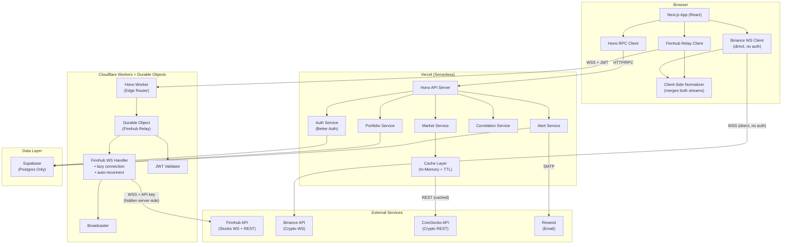

### Why This Topology

The browser manages **two** WebSocket connections independently:

| Connection | Target | Auth Required | Goes Through Backend |
|-----------|--------|--------------|---------------------|
| Crypto prices | Binance directly | No (public API) | No |
| Stock prices | Finnhub relay on Cloudflare DO | JWT (to access relay) | Yes (API key hidden) |

A client-side normalizer merges both streams into a unified `MarketUpdate` shape so the rest of the UI doesn't know or care where data came from.

This is the minimal architecture — no unnecessary middleware between the browser and Binance, and only the smallest possible relay for Finnhub where we actually need one.

---

## Directory Structure

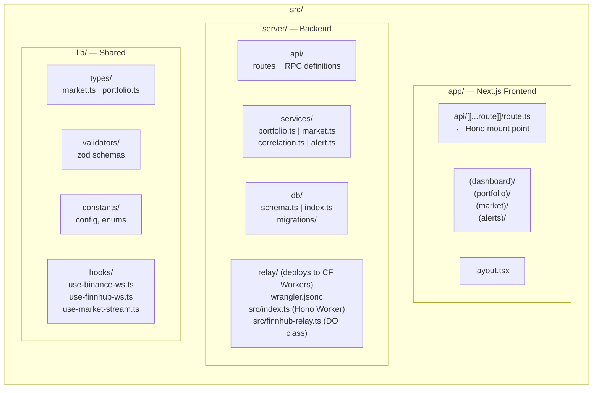

Note: The `relay/` directory is a separate deployable unit targeting Cloudflare Workers. No Binance handler on the server — the browser connects to Binance directly. Normalization lives in client-side hooks.

---

## Data Flow Maps

### Flow 1: Dashboard Load (Initial + Real-Time)

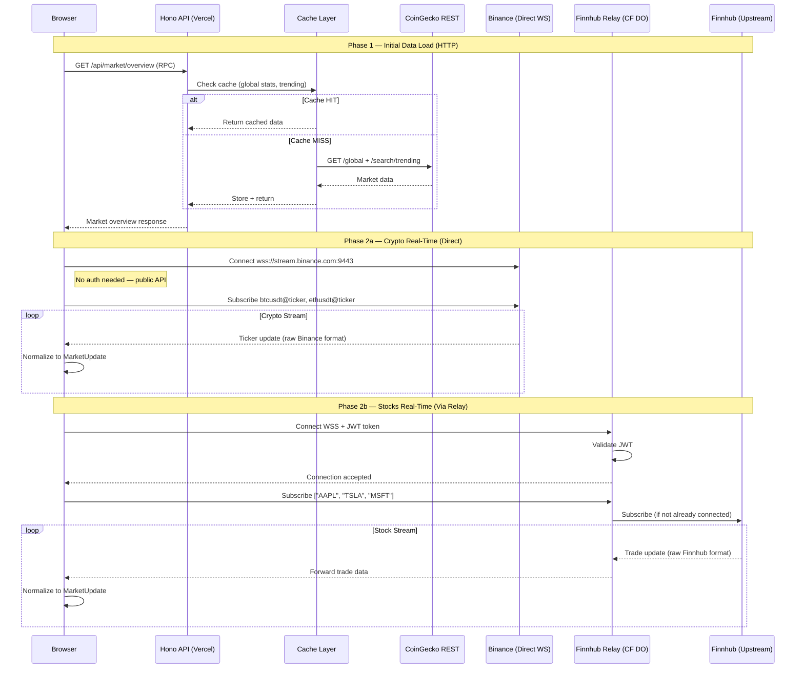

### Flow 2: Portfolio Operations

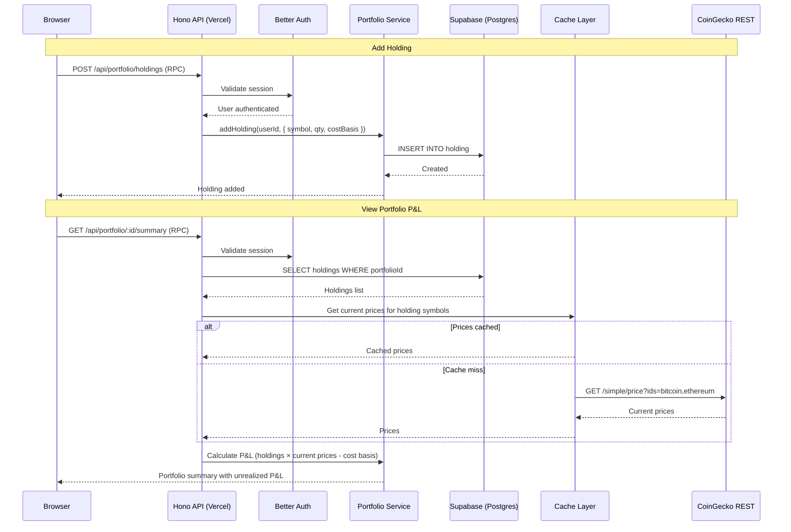

### Flow 3: Stablecoin Peg Monitor + Alert

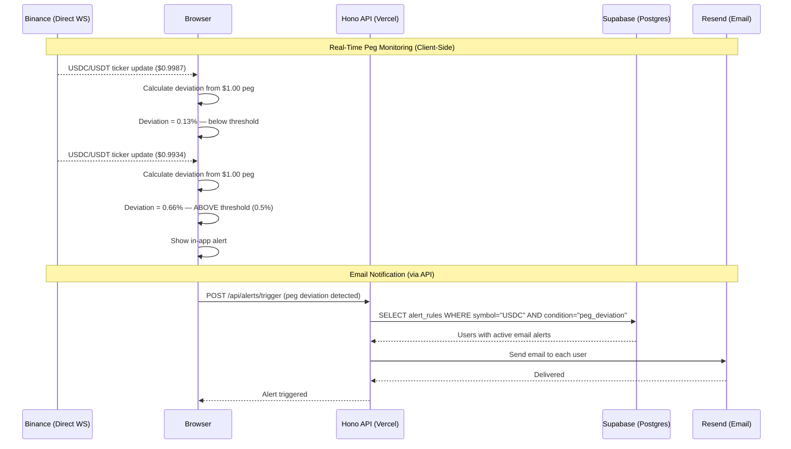

Note: Peg monitoring is now **client-side** since the browser already has the direct Binance stream. The browser detects deviations and notifies the API to send emails. This is simpler than having the relay detect it.

### Flow 4: Cross-Origin Auth (Finnhub Relay Only)

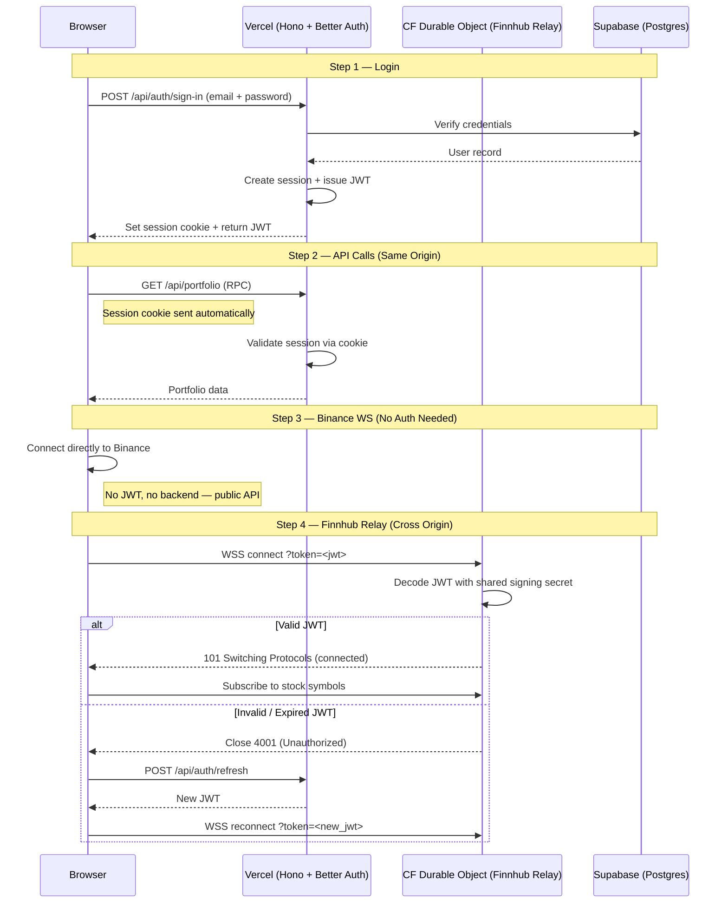

---

## Entity Relationship Diagram

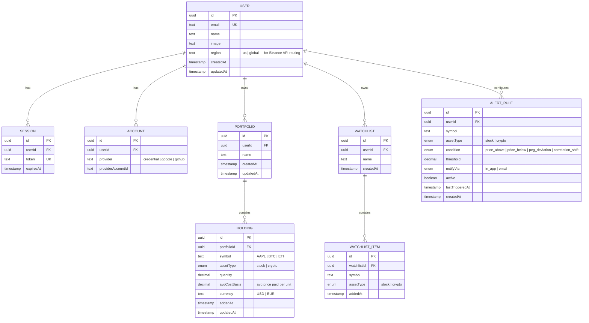

---

## Unified Market Data Schema

Both Binance and Finnhub send data in different formats. The **client-side normalizer** transforms both into a single shape so the UI layer has one interface to work with.

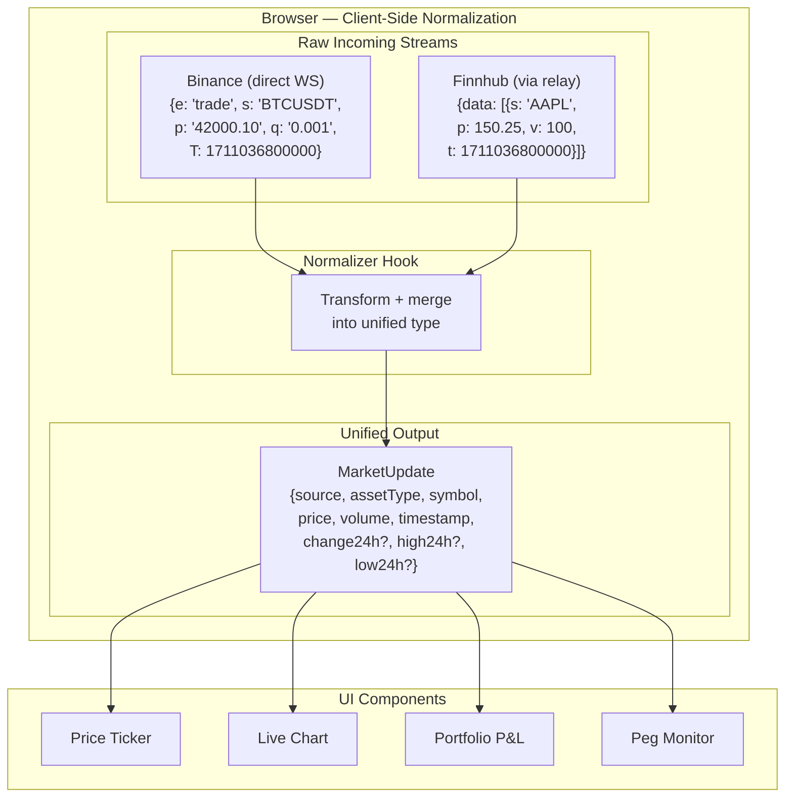

```typescript
type MarketUpdate = {
  source: 'finnhub' | 'binance'
  assetType: 'stock' | 'crypto'
  symbol: string          // normalized: "AAPL", "BTC/USDT"
  price: number
  volume: number
  timestamp: number       // unix ms
  change24h?: number
  high24h?: number
  low24h?: number
}
```

---

## Finnhub Relay — Internal Architecture

The relay is intentionally minimal. It does one thing: proxy Finnhub WebSocket data to authenticated browser clients while keeping the API key server-side.

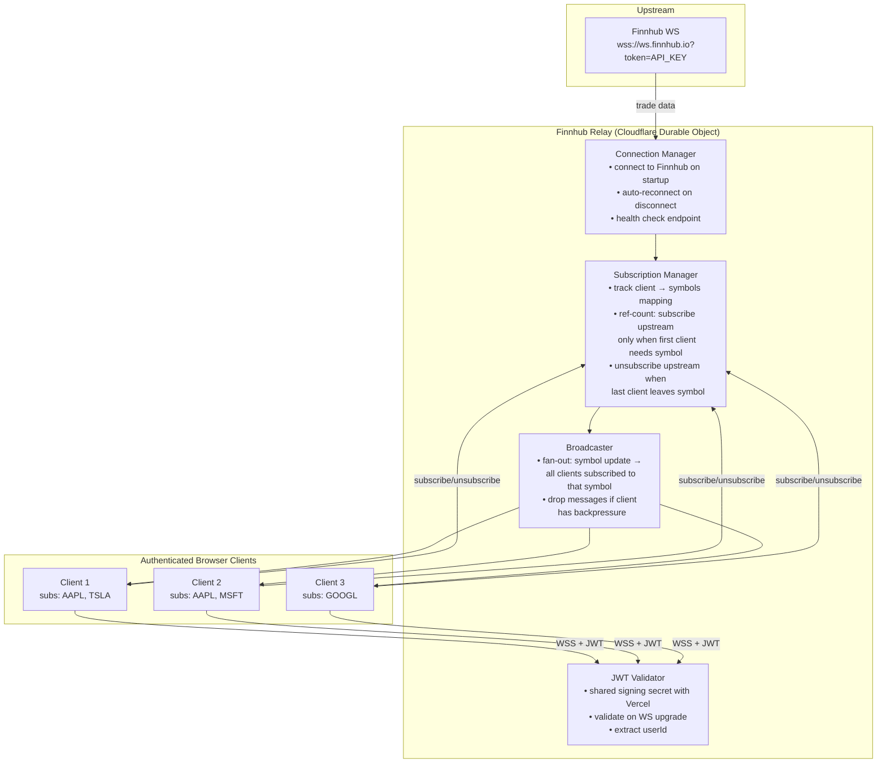

### Subscription Reference Counting

The relay only subscribes to Finnhub symbols that at least one client needs. This respects Finnhub's 50-symbol free tier limit.

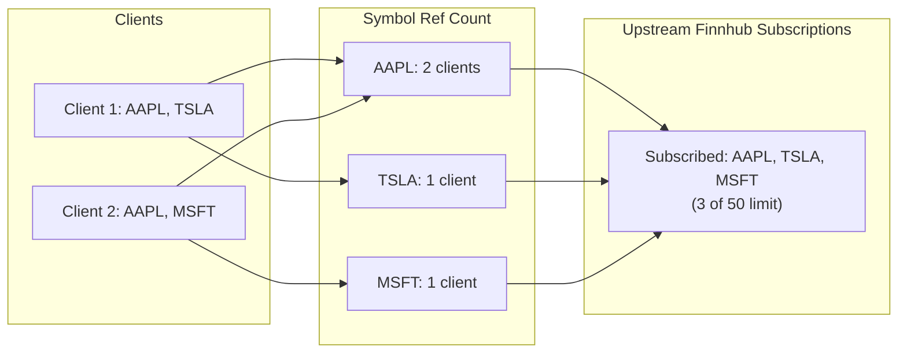

When Client 1 disconnects: AAPL drops to 1 (stays subscribed), TSLA drops to 0 (unsubscribe upstream).

---

## Binance Direct Connection — Browser Architecture

No backend. The browser connects directly to Binance's public WebSocket streams.

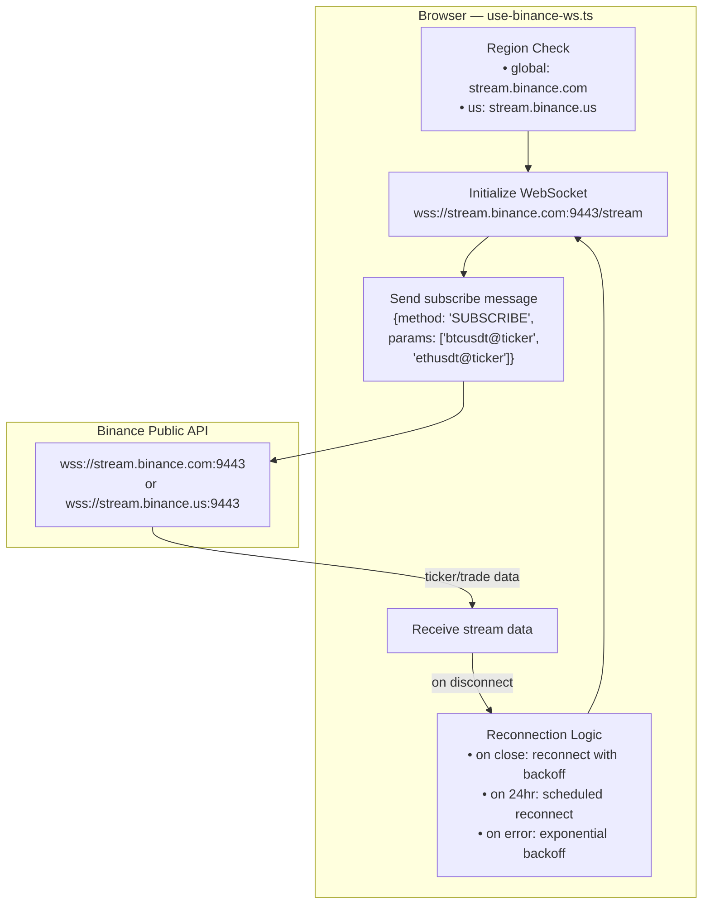

### Reconnection Strategy

| Event | Action |
|-------|--------|
| Connection drops unexpectedly | Exponential backoff: 1s → 2s → 4s → 8s → max 30s |
| 24-hour expiry approaching | Pre-schedule reconnect at 23h 50m, resubscribe all streams |
| Network goes offline | Pause reconnection, resume when `navigator.onLine` fires |
| Tab becomes hidden | Optionally reduce subscription frequency or disconnect (saves resources) |

---

## Caching Architecture

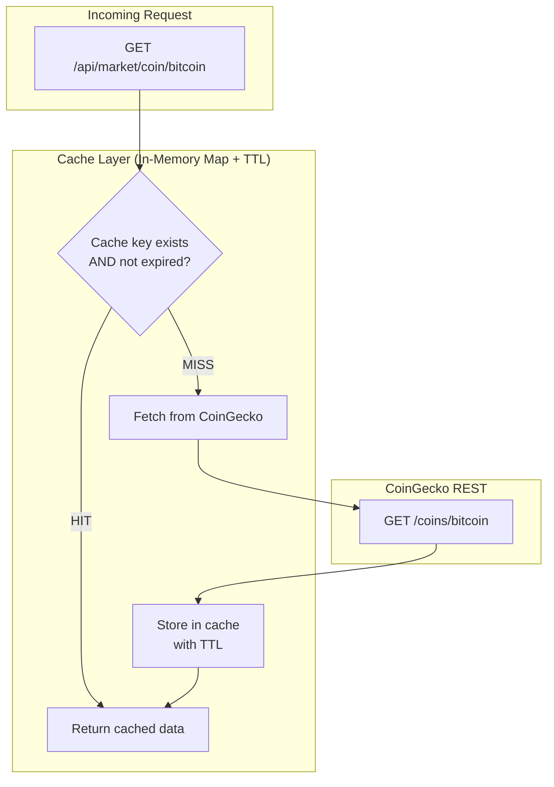

### TTL Configuration

| Data | Cache Key Pattern | TTL | Monthly Call Budget |
|------|------------------|-----|-------------------|
| Coin metadata | `coin:meta:{id}` | 24 hours | ~2,000 |
| Market rankings | `market:rankings:{page}` | 2 minutes | ~4,000 |
| Historical charts | `chart:{id}:{days}` | 10 minutes | ~2,000 |
| Trending coins | `trending` | 10 minutes | ~500 |
| Global market stats | `global` | 5 minutes | ~500 |
| Exchange rates | `exchange_rates` | 5 minutes | ~500 |
| Search results | `search:{query}` | 5 minutes | ~500 |
| **Total** | | | **~10,000** |

---

## Graceful Degradation Map

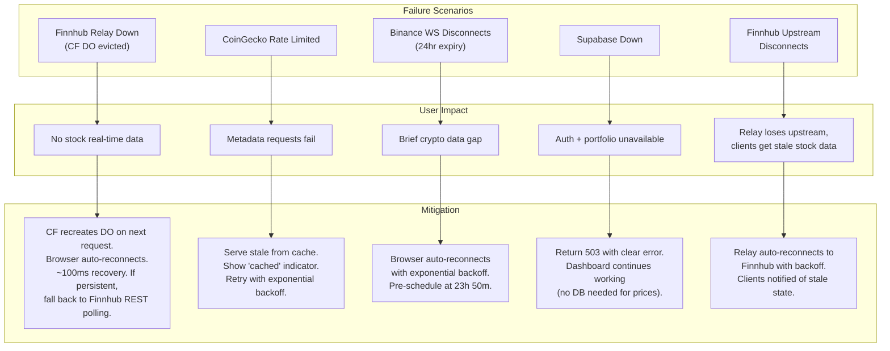

---

## Staged Implementation Plan

```mermaid
gantt
    title Owl — Staged Feature Delivery
    dateFormat X
    axisFormat Stage %s

    section Foundation
    Scaffold + Auth + DB            :s1, 1, 2
    section Market Data
    CoinGecko Integration + Dashboard :s2, 2, 3
    section Real-Time
    Binance Direct + Finnhub Relay  :s3, 3, 4
    section Portfolio
    Portfolio Tracker + P&L         :s4, 4, 5
    section Engagement
    Watchlists + Alerts             :s5, 5, 6
    section Stablecoin
    Peg Monitor                     :s6, 6, 7
    section Analytics
    Correlation Engine              :s7, 7, 8
    section Optimization
    Settlement Optimizer            :s8, 8, 9
```

| Stage | Feature | Key Deliverables |
|-------|---------|-----------------|
| **1** | Scaffold + Auth + DB | Next.js + Hono mounted, Better Auth (email/password), Drizzle schema + Supabase Postgres, base layout |
| **2** | Market Data + Dashboard | CoinGecko integration with caching, coin list + search, global stats, trending, coin detail with charts |
| **3** | Real-Time Prices | Browser direct to Binance WS, Finnhub relay on Cloudflare DO (lazy connection), client-side normalizer hook, live ticker, reconnection logic |
| **4** | Portfolio Tracker | CRUD portfolios/holdings, P&L calculation against live + cached prices, unified stock + crypto view |
| **5** | Watchlists + Alerts | Watchlist CRUD, alert rules, in-app notifications, email via Resend |
| **6** | Peg Monitor | USDC/USDT peg tracking (client-side via Binance stream), deviation alerts, historical peg chart |
| **7** | Correlation Engine | Cross-market correlation (BTC vs NASDAQ), correlation matrix, configurable time windows |
| **8** | Settlement Optimizer | Fiat vs stablecoin path comparison, real-time spreads, optimal path recommendation |

---

## Consequences

### Positive
- **Minimal backend surface area** — Cloudflare DO only runs Finnhub relay, not a full WS relay for both providers
- **No unnecessary middleware** — Binance data flows directly to the browser with zero latency overhead
- **No extra vendor dependencies** — no Ably/Pusher SDK, no message limits, no vendor risk
- **Type safety end-to-end** via Hono RPC
- **$0 relay infra cost** — Cloudflare DO free tier covers market-hours usage with margin
- **Each service independently testable** — Binance connection works without the relay, API works without either WS source
- **Strong interview narrative** — demonstrates targeted decision-making based on actual constraints, not over-engineering

### Negative
- **Two WebSocket connections in the browser** — slightly more client-side complexity, but manageable via hooks
- **Client-side normalization** — if the unified schema changes, it's a frontend deploy, not a backend-only change
- **Cross-origin auth still needed** for the Finnhub relay on CF DO (JWT validation)
- **In-memory cache on Vercel is lost on cold starts** — first request after cold start hits CoinGecko
- **Cloudflare DO platform lock-in** — relay uses DO-specific APIs (mitigated by documented Railway fallback in ADR-003)

### Risks
- **Binance geo-restriction** — blocked in US. Mitigation: region-aware routing to Binance.US (fewer pairs but same API shape)
- **Binance 24-hour WS expiry** — browser must handle scheduled reconnection
- **Finnhub 50-symbol limit** — shared across all connected clients via ref counting. Could be hit with many users watching different symbols
- **CoinGecko 10K monthly budget** — tight but manageable with proper TTLs. Misconfigured cache could exhaust it mid-month
- **Vercel function timeout (300s)** on hobby plan — correlation computation on large historical ranges may need precomputation
- **CF DO can be evicted anytime** — Cloudflare may restart DOs for infrastructure reasons. Reconnection logic handles this, but brief data gaps are possible

## Related Decisions
- [ADR-001: API Provider Selection](./001-api-provider-selection.md)
- [ADR-003: WebSocket Hosting Decision](./003-websocket-hosting.md) — Cloudflare DO selected over Railway, Fly.io, Render, and Ably
- ADR-004: Tech Stack Choices — pending
