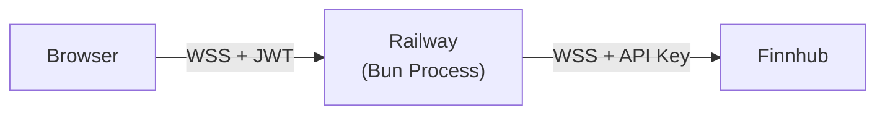
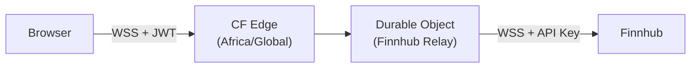
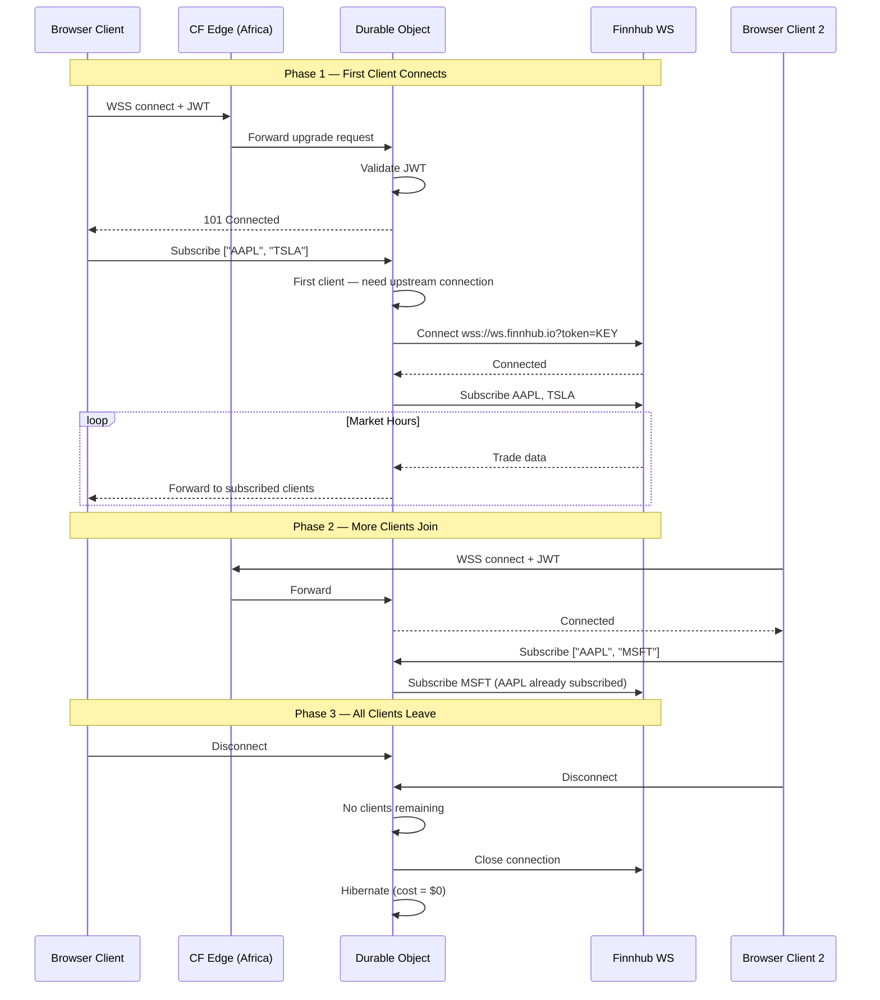
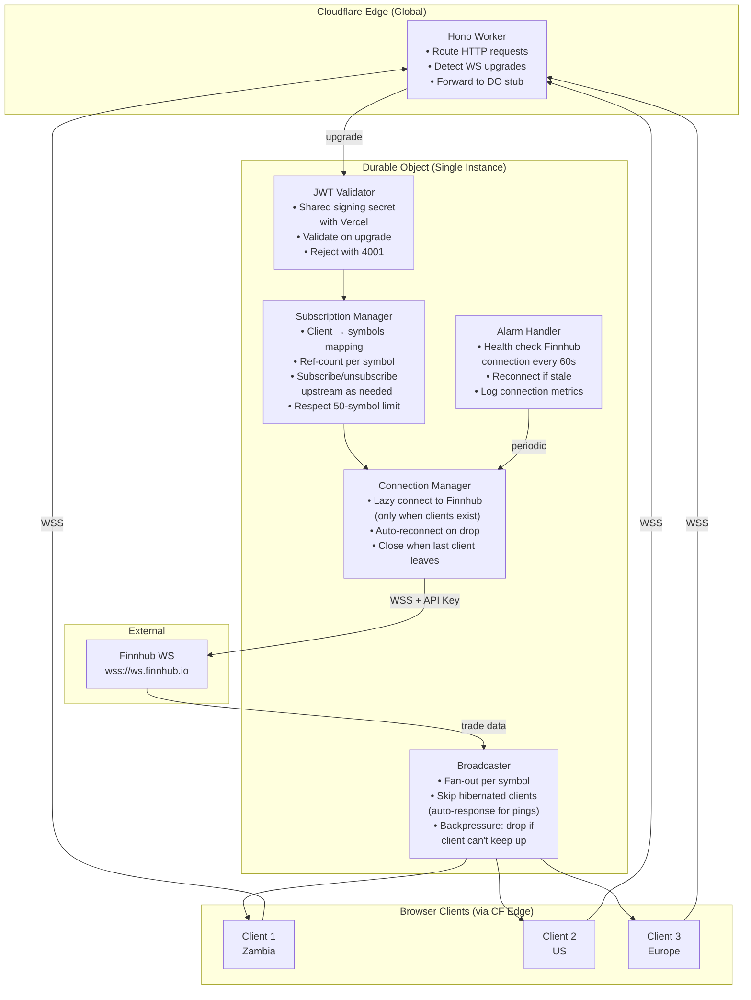
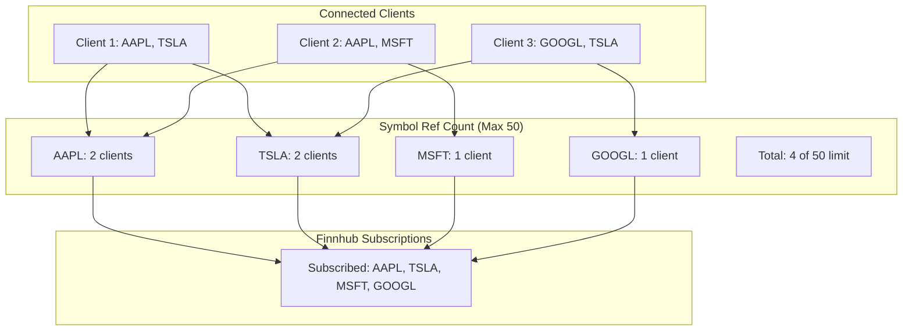
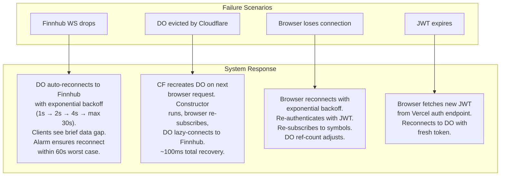
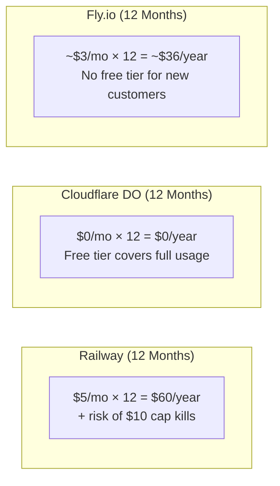

# ADR-003: WebSocket Hosting Decision

**Status:** Accepted
**Date:** 2026-03-21
**Decision Makers:** @mvula

## Context

Owl requires a persistent server-side process to proxy Finnhub WebSocket data to browser clients. The Finnhub API key must remain server-side — exposing it in the browser allows anyone to extract and abuse it. Binance's public WebSocket requires no auth and the browser connects directly (see [ADR-002](./002-system-architecture.md)).

### Constraints

1. **Vercel cannot host WebSocket connections.** Vercel is serverless. Functions are short-lived and stateless. WebSocket upgrades are not supported. Edge Functions and Middleware cannot proxy WebSocket connections. This is a hard platform limitation — not a configuration issue.

2. **The relay needs a persistent outbound WebSocket** to Finnhub (`wss://ws.finnhub.io?token=API_KEY`), receiving a continuous stream of trade data and fanning it out to authenticated browser clients.

3. **DevDraft's target market is Africa** (Zambia, Malawi). Latency to African users matters for real-time data delivery.

4. **DevDraft's infrastructure uses Cloudflare** in front of Vercel. Stack alignment is a strategic consideration for potential acquisition.

5. **Budget target is $0/month** for early stage. Every dollar of infra cost must be justified.

### What We Need From The Host

- Persistent outbound WebSocket to Finnhub (hours-long connection during market hours)
- Accept inbound WebSocket connections from authenticated browser clients
- Fan-out: broadcast Finnhub data to all subscribed clients
- Auto-reconnect on upstream disconnection
- Health monitoring
- Deployable from a monorepo (same repo as Next.js frontend)

---

## Decision

**Cloudflare Workers + Durable Objects** for the Finnhub WebSocket relay, with a lazy connection pattern. Railway documented as fallback.

---

## Options Evaluated

### Option A: Railway (Long-Lived Bun Process)

A Bun process on Railway maintains a persistent WebSocket to Finnhub and serves browser clients.



**Pricing:**
- Hobby plan: $5/mo subscription, includes $5 usage credit
- Actual cost for a light relay: ~$3-5/mo (CPU ~0.1 vCPU, RAM ~100MB)
- Hard cap: $10 usage on Hobby — **service is killed if exceeded**

**Strengths:**
| Strength | Detail |
|----------|--------|
| Designed for this | Long-lived processes are Railway's core use case |
| Always-on | Process runs 24/7, no cold starts |
| Native Bun | `new WebSocket()` works out of the box |
| No connection limits | OS-level limits only (thousands) |
| Simple deployment | Dockerfile or Nixpacks, root directory config for monorepos |
| Excellent DX | CLI, GitHub integration, real-time logs, env var management |

**Weaknesses:**
| Weakness | Detail | Severity |
|----------|--------|----------|
| Cost | $5/mo minimum, runs 24/7 even with zero users | Medium |
| $10 hard cap | Service killed if usage exceeds $10. DDoS or traffic spike = outage | **High** |
| Africa latency | Closest region: Netherlands (~150-250ms to Zambia/Malawi) | **High** |
| No auto-scaling | Single instance on Hobby. Manual scaling only | Medium |
| Proxy idle timeout | ~5 min idle timeout on WS connections. Requires heartbeats | Low (standard practice) |
| Redeploys kill connections | No graceful WS draining. All clients disconnect on deploy | Low (reconnection required anyway) |
| No DDoS protection | Must implement rate limiting yourself or add Cloudflare in front | Medium |
| Stack misalignment | DevDraft uses Cloudflare. Railway adds a different vendor | Low-Medium |

### Option B: Cloudflare Workers + Durable Objects

A Durable Object maintains the outbound Finnhub WebSocket and accepts inbound browser clients. Hono handles the Worker routing layer.



**Pricing (Free Tier):**
- 100,000 requests/day
- 13,000 GB-seconds/day of compute duration
- WebSocket messages: 20:1 billing ratio (1M WS messages = 50K requests)

**Cost math for our use case:**

```
Market hours: 6.5 hours/day, 22 trading days/month

Outbound (Finnhub → DO):
  50 symbols × 1 msg/sec × 6.5h × 3600s = 1,170,000 messages/day
  ÷ 20 (WS billing ratio) = 58,500 requests/day
  Free tier: 100,000/day ✓

Duration (DO pinned in memory during market hours):
  128MB = 0.125 GB
  6.5h × 3600s × 0.125 GB = 2,925 GB-s/day
  Free tier: 13,000 GB-s/day ✓ (22% utilization)

Off-market hours: DO hibernates, cost = $0

Weekend: No market activity, DO hibernates, cost = $0

Monthly cost: $0
```

**Strengths:**
| Strength | Detail |
|----------|--------|
| $0 cost | Free tier comfortably covers market-hours-only usage |
| Africa edge nodes | Cloudflare has PoPs across Africa — last-mile latency <50ms to browsers |
| Lazy connection pattern | Connect to Finnhub only when browsers are connected. Zero cost when idle |
| Built-in DDoS protection | Cloudflare's network-level protection included |
| Auto-scaling | DOs scale per-instance automatically |
| Stack alignment | DevDraft uses Cloudflare. Same vendor = integration story |
| Hono compatible | `@hono/cloudflare-workers` + DO examples documented |
| No idle timeout | Cloudflare manages the edge. No proxy timeout to work around |
| V8 isolate cold starts | <5ms (vs container spin-up on Railway) |

**Weaknesses:**
| Weakness | Detail | Severity |
|----------|--------|----------|
| Outbound WS pins DO in memory | Cannot hibernate while Finnhub connection is active. Negates primary DO cost advantage | Medium (acceptable during market hours; lazy pattern mitigates during off-hours) |
| 6 outbound connections limit | Hard limit per DO invocation. Currently need 1 (Finnhub), but ceiling is low | **Medium** (limits future extensibility) |
| DO can restart anytime | Cloudflare may evict/restart DOs for infra reasons. All connections lost | Medium (reconnection logic required regardless of host) |
| Hibernation blocked | Open feature request ([workerd#4864](https://github.com/cloudflare/workerd/issues/4864)) for outbound WS hibernation — confirms this is a known platform gap | Low (only matters for cost, and free tier covers us) |
| Debugging harder | DO state inspection is limited compared to a regular server process | Low-Medium |
| 128MB memory per DO | Hard limit. Limits number of concurrent browser connections per DO | Low (thousands of quiet connections fit in 128MB) |
| ~1,000 req/sec soft limit | Per-DO throughput ceiling. Exceeding triggers "overloaded" errors | Low (unlikely at early stage) |
| Platform lock-in | DO-specific APIs. Migration to another platform requires rewrite | Medium |

### Option C: Fly.io (Long-Lived Process)

Similar to Railway but with African regions (Johannesburg).

| Pros | Cons |
|------|------|
| Johannesburg region (lowest Africa latency of any traditional PaaS) | No free tier for new customers |
| Always-on VMs | ~$2-3/mo minimum (shared-cpu-1x, 256MB) |
| Good WebSocket support | More complex deployment (Fly-specific config) |
| | Smaller community than Railway or Cloudflare |

**Not selected because:** No free tier eliminates the $0 target. Cloudflare matches the Africa latency advantage via edge nodes while being free.

### Option D: Render (Background Worker)

| Pros | Cons |
|------|------|
| Free tier for web services | Free tier sleeps after inactivity (kills WS connections) |
| Simple deployment | No WebSocket-specific optimizations |
| | Slow cold starts (~30s) |
| | Limited regions |

**Not selected because:** Free tier sleeping behavior is incompatible with a persistent WebSocket relay.

---

## Comparison Matrix

```mermaid
graph TB
    subgraph Comparison["Decision Matrix"]
        direction TB
        HEADER["Dimension | Railway | CF DO | Fly.io | Render"]
        R1["Cost/mo        | $5      | $0    | ~$3    | $0*   "]
        R2["Africa latency  | 150-250ms| <50ms | <50ms  | 200ms+"]
        R3["Outbound WS     | Native  | Works | Native | Works "]
        R4["Connection limit | None    | 6     | None   | None  "]
        R5["Auto-scale      | No      | Yes   | No     | No    "]
        R6["DDoS protection | No      | Yes   | No     | No    "]
        R7["Stack alignment | No      | Yes   | No     | No    "]
        R8["Hibernation     | N/A     | Blocked| N/A   | Sleep*"]
        R9["Kill risk       | $10 cap | None  | None   | Sleep "]
    end
```



| Dimension | Railway | Cloudflare DO | Fly.io | Render |
|-----------|:-------:|:------------:|:------:|:------:|
| Monthly cost | $5 | **$0** | ~$3 | $0 (but sleeps) |
| Africa latency (browser) | 150-250ms | **<50ms** | <50ms | 200ms+ |
| Outbound WS support | Native | Works (with caveats) | Native | Works |
| Outbound connection limit | Unlimited | **6 hard limit** | Unlimited | Unlimited |
| Auto-scaling | No | **Yes** | No | No |
| Built-in DDoS protection | No | **Yes** | No | No |
| DevDraft stack alignment | No | **Yes** | No | No |
| Hibernation when idle | N/A (always runs) | Blocked by outbound WS | N/A | Forced (kills connections) |
| Service kill risk | **$10 cap = killed** | None on free tier | None (pay-as-you-go) | Sleeps after idle |
| Cold start | None | <5ms | ~1-3s | ~30s |
| Monorepo deployment | Root directory config | wrangler.jsonc subfolder | fly.toml | render.yaml |
| Hono support | Native (Bun) | @hono/cloudflare-workers | Native (Bun/Node) | Native (Node) |
| DX quality | Excellent | Good (DOs harder to debug) | Good | Good |

---

## Detailed Architecture: Cloudflare DO Relay

### Lazy Connection Pattern

The DO only connects to Finnhub when at least one browser client is subscribed. When all clients disconnect, the Finnhub connection is closed and the DO can hibernate — costing $0.



### Component Architecture



### Subscription Reference Counting (Respecting Finnhub 50-Symbol Limit)



When a client requests a 51st unique symbol:
1. Check ref count total
2. If at 50, reject subscription with error: `{ error: "SYMBOL_LIMIT_REACHED", max: 50 }`
3. Client can unsubscribe from another symbol to make room
4. This is communicated clearly in the API contract

### Reconnection & Fault Tolerance



### Deployment from Monorepo

```
owl/
├── src/
│   ├── app/                    ← Next.js (deploys to Vercel)
│   ├── server/                 ← Hono API (deploys with Next.js)
│   └── lib/                    ← Shared types
├── relay/                      ← Finnhub relay (deploys to CF Workers)
│   ├── wrangler.jsonc          ← Worker + DO config
│   ├── src/
│   │   ├── index.ts            ← Hono Worker (routes, WS upgrade detection)
│   │   └── finnhub-relay.ts    ← Durable Object class
│   └── package.json            ← Relay-specific dependencies
├── package.json                ← Root package.json
└── docs/
    └── adrs/
```

```jsonc
// relay/wrangler.jsonc
{
  "name": "owl-relay",
  "main": "src/index.ts",
  "compatibility_date": "2026-03-01",
  "durable_objects": {
    "bindings": [
      {
        "name": "FINNHUB_RELAY",
        "class_name": "FinnhubRelay"
      }
    ]
  },
  "migrations": [
    {
      "tag": "v1",
      "new_classes": ["FinnhubRelay"]
    }
  ],
  "vars": {
    "ENVIRONMENT": "production"
  }
}
```

Deploy command:
```bash
cd relay && npx wrangler deploy
```

---

## Cost Comparison Over 12 Months



| Platform | Year 1 Cost | Year 1 Risk |
|----------|------------|-------------|
| Railway | $60 | Service killed if traffic spike exceeds $10 cap |
| Cloudflare DO | **$0** | Free tier ceiling (~100K req/day) is high but finite |
| Fly.io | ~$36 | Pay-as-you-go, no kill switch |

---

## Why Cloudflare DO Over Railway

This is the core of the decision. Five reasons, each with a clear "why":

### 1. $0 vs $60/year
**Why it matters:** Early-stage product with no revenue. Every dollar of runway matters. The lazy connection pattern means we pay literally nothing when no users are connected — nights, weekends, off-market hours. Railway runs 24/7 regardless.

### 2. Africa Latency (<50ms vs 150-250ms)
**Why it matters:** DevDraft's users are in Zambia and Malawi. Cloudflare has edge nodes across Africa. The last mile from Cloudflare's edge to the browser is dramatically faster than routing through Railway's Netherlands region. For a real-time financial dashboard, 200ms of unnecessary latency is the difference between "this feels live" and "this feels laggy."

### 3. DevDraft Stack Alignment
**Why it matters:** DevDraft runs their entire infrastructure behind Cloudflare (`server: cloudflare` on devdraft.ai, api.devdraft.ai, and console.devdraft.ai). If Owl is ever acquired or integrated into DevDraft's stack, it's already on the same platform. No vendor migration. No new billing relationship. Their ops team already knows how to manage Cloudflare Workers.

### 4. Built-In DDoS Protection
**Why it matters:** Railway exposes your service directly. A DDoS or traffic spike can hit the $10 cap and kill your service. Cloudflare's network absorbs attacks at the edge before they reach your DO. For a financial product, uptime is not optional.

### 5. The Lazy Pattern Is Better Engineering
**Why it matters:** Railway runs 24/7 — consuming resources even at 3am on a Sunday when nobody is watching. The DO lazy pattern connects upstream only when a human is actually looking at the dashboard. This isn't just cheaper — it's more correct. A system that consumes resources proportional to actual demand is a better-designed system.

## Why Not Railway (Addressing Its Strengths)

| Railway Strength | Counter-Argument |
|-----------------|------------------|
| "Designed for long-lived processes" | True, but our process only needs to be alive during market hours when users are connected. The lazy pattern makes "always-on" a waste. |
| "No outbound connection limits" | We need 1 outbound WS (Finnhub). The 6-connection limit on CF is not a constraint today. If we add 5+ more upstream feeds, we revisit. |
| "Better DX / easier debugging" | True. DO debugging is harder. But this is a developer experience trade-off, not a user experience or cost trade-off. We optimize for users and business first. |
| "Native Bun support" | Cloudflare Workers run V8, not Bun. But our relay logic is simple — standard WebSocket API, no Bun-specific features needed. |

---

## Fallback Plan

If Cloudflare Durable Objects prove problematic in practice (debugging too hard, hitting limits, unexpected behavior), the migration path to Railway is straightforward:

1. The relay logic (connection manager, subscription manager, broadcaster) is the same regardless of host
2. Abstract the WebSocket server interface behind a thin adapter
3. Railway deployment: add `Dockerfile` + `railway.toml`, point at the same source code
4. Swap the relay URL in the frontend config (environment variable)
5. Total migration effort: ~2-4 hours

This fallback is documented, not hypothetical. The code will be structured to make this swap trivial.

---

## Consequences

### Positive
- $0 infrastructure cost for the relay layer
- Sub-50ms latency to African users (DevDraft's market)
- Stack alignment with DevDraft's Cloudflare infrastructure
- DDoS protection included at the network level
- Lazy connection pattern = resources proportional to actual demand
- Auto-scaling if usage grows

### Negative
- Outbound WebSocket pins DO in memory (no hibernation during active market streaming)
- 6 outbound connection hard limit constrains future upstream feed expansion
- Durable Object debugging and state inspection is harder than a regular server
- Cloudflare-specific APIs create some platform lock-in (mitigated by documented Railway fallback)
- V8 runtime, not Bun — no Bun-specific APIs available in the relay

### Risks
- Cloudflare can evict/restart DOs at any time — all connections lost (mitigated: reconnection logic is required regardless of host)
- Free tier limits could change (mitigated: current usage is well within limits with margin)
- Outbound WebSocket hibernation gap may not be resolved soon ([workerd#4864](https://github.com/cloudflare/workerd/issues/4864))
- 128MB memory limit per DO — could be hit with very high concurrent connection count (mitigated: unlikely at early stage, and DO auto-scales by creating new instances)

## Related Decisions
- [ADR-001: API Provider Selection](./001-api-provider-selection.md)
- [ADR-002: System Architecture](./002-system-architecture.md) — needs update to reflect Cloudflare DO instead of Railway
- ADR-004: Tech Stack Choices — pending
