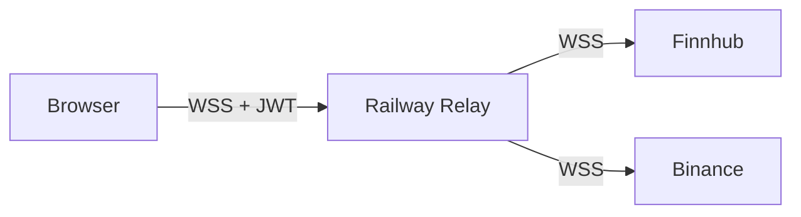
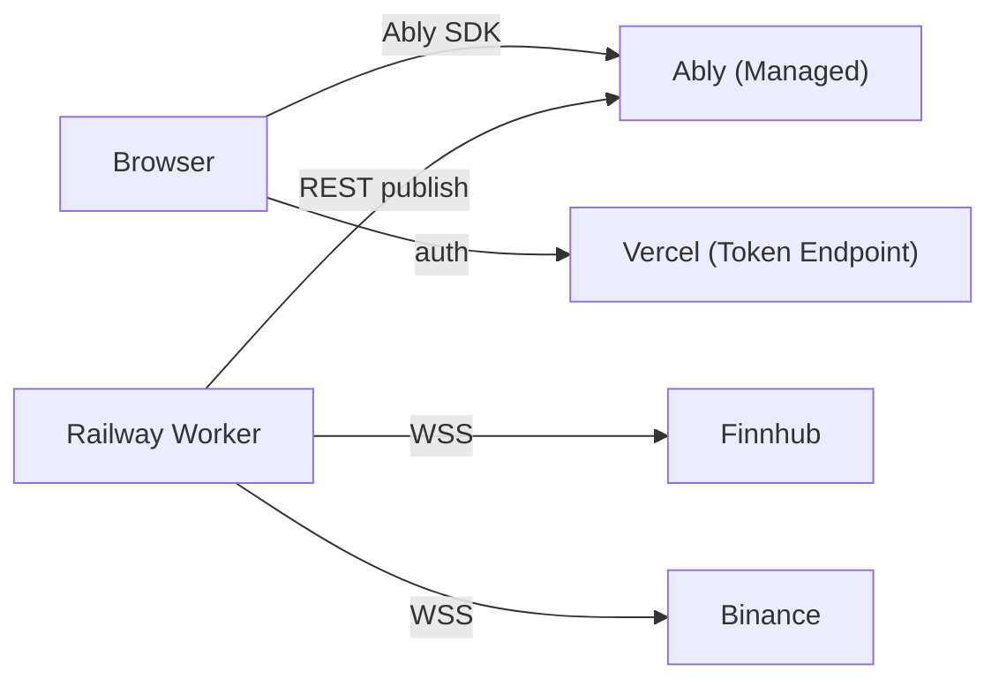
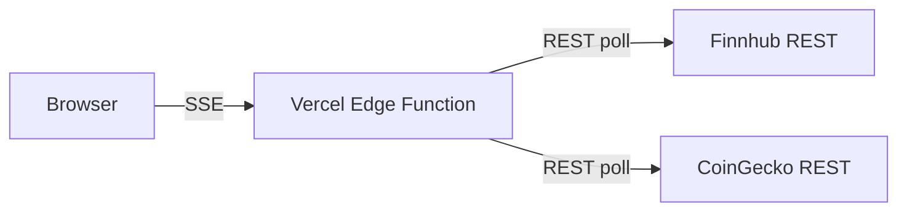
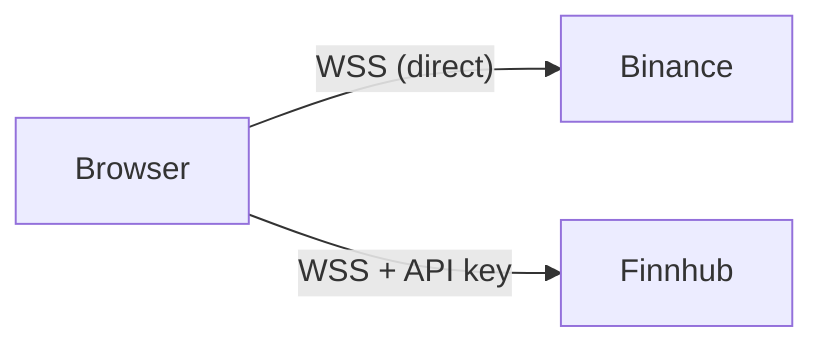
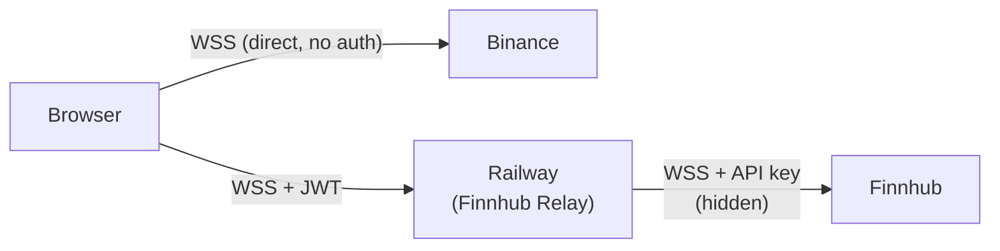

# ADR-003: WebSocket Hosting Decision

**Status:** Accepted
**Date:** 2026-03-21
**Decision Makers:** @mvula

## Context

Owl needs real-time price data from two upstream providers:
- **Finnhub** — stocks/forex, WebSocket requires API key in the URL (`wss://ws.finnhub.io?token=API_KEY`)
- **Binance** — crypto, WebSocket is fully public with no auth (`wss://stream.binance.com:9443/ws/<stream>`)

The frontend is hosted on **Vercel**, which is serverless and **cannot** maintain persistent WebSocket connections. This is a hard platform constraint — Vercel Edge Functions and Middleware cannot proxy WebSocket upgrades. There is no workaround.

This ADR documents the evaluation of five approaches and the rationale for the selected hybrid architecture.

## Decision

**Hybrid approach:** Browser connects directly to Binance (no backend). A minimal Finnhub-only relay runs on Railway to keep the API key server-side.

## Options Evaluated

### Option A: Full Custom WS Relay on Railway

Both Finnhub and Binance connections proxied through a single relay on Railway.



**Components owned:** ~8 (connection manager, normalizer, subscription manager, broadcaster, JWT validator, health checks, reconnection logic for both upstreams, backpressure handling)

| Pros | Cons |
|------|------|
| Single WebSocket from browser | Unnecessary middleware for Binance (adds latency, no benefit) |
| Server-side normalization | 8 components to build, test, maintain |
| Full control | Cross-origin auth complexity for all real-time data |
| | Binance data routed through Railway for no reason |

**Rejected because:** Routing Binance through a relay adds latency and complexity with zero benefit — Binance requires no auth and works directly from the browser.

### Option B: Ably (Managed) + Railway Ingestion Worker

Ably handles client connections and fan-out. Railway worker connects to upstreams and publishes to Ably channels.



**Components owned:** ~4 (upstream handlers, normalizer, Ably token endpoint)

| Pros | Cons |
|------|------|
| Ably handles client connections, reconnection, fan-out | **Free tier math doesn't work** (see below) |
| Simpler worker (no client management) | Still needs Railway for upstream connections |
| Built-in presence and state recovery | +51KB bundle (Ably SDK) |
| | Adds a vendor dependency for a core feature |
| | Two failure points (worker + Ably) instead of one |
| | $29+/mo paid plan needed for real usage |

**Free tier message math:**
```
50 symbols × 1 update/sec × 6.5 market hours × 3600 sec × 22 trading days
= 25,740,000 messages/month (publishes only)

Free tier limit: 6,000,000 messages/month
Exceeded by 4.3x — and that's without counting subscriber deliveries
```

Even with aggressive batching (all 50 symbols in one message every 5 seconds), the free tier only supports ~10 concurrent users before hitting 6M messages. Real usage requires a $29+/mo paid plan.

**Rejected because:** Ably doesn't eliminate Railway (you still need an ingestion worker). It adds a vendor dependency, a paid plan, and SDK bloat — all to replace client WebSocket management that the browser can handle natively.

### Option C: SSE from Vercel Edge Functions

Vercel Edge Functions stream data to the browser via Server-Sent Events, polling upstream REST APIs internally.



| Pros | Cons |
|------|------|
| Single deployment (Vercel only) | Functions timeout at 300s (hobby) — must reconnect every 5 minutes |
| No Railway needed | Polling REST APIs, not using WebSocket feeds |
| Simple architecture | Higher latency (~60s data freshness, not real-time) |
| | Wastes CoinGecko call budget on polling |
| | Unidirectional (can't send subscribe/unsubscribe from client) |

**Rejected because:** This is polling dressed up as streaming. We'd be paying for WebSocket-capable APIs and not using their WebSocket feeds. Data freshness drops to ~60 seconds. Not acceptable for a "real-time" dashboard.

### Option D: Browser Direct to Both (No Backend)

Browser connects directly to both Finnhub and Binance WebSockets.



| Pros | Cons |
|------|------|
| Zero backend for real-time | **Finnhub API key exposed in browser** |
| Lowest possible latency | Anyone can extract the key from DevTools |
| Simplest architecture | Key abuse exhausts rate limits |
| No Railway cost | No origin-restricted keys available from Finnhub |

**Rejected because:** Exposing the Finnhub API key in the browser is a security risk. The free tier key has rate limits — anyone who extracts it can consume your quota. Finnhub does not support origin-restricted API keys.

### Option E (Selected): Hybrid — Direct Binance + Minimal Finnhub Relay

Browser connects directly to Binance. A minimal relay on Railway proxies only Finnhub data.



**Components owned:** ~3 (Finnhub handler, JWT validator, broadcaster)

| Pros | Cons |
|------|------|
| No unnecessary middleware | Two WS connections in browser |
| Finnhub API key stays server-side | Cross-origin auth needed (Finnhub relay only) |
| Zero latency overhead for crypto | Client-side normalization (two formats → one) |
| No vendor dependencies | Railway still needed ($5/mo) |
| Smallest possible relay (~3 components) | |
| Lowest cost ($5/mo Railway hobby) | |
| 0KB added bundle (native WebSocket API) | |

## Comparison Matrix

| Dimension | A: Full Relay | B: Ably | C: SSE | D: Direct Both | E: Hybrid |
|-----------|:---:|:---:|:---:|:---:|:---:|
| Railway needed | Yes (full) | Yes (worker) | No | No | Yes (minimal) |
| Components you own | ~8 | ~4 | ~2 | ~1 | **~3** |
| Real-time capable | Yes | Yes | No (polling) | Yes | **Yes** |
| API keys secure | Yes | Yes | Yes | **No** | **Yes** |
| Extra vendor | No | **Yes (Ably)** | No | No | **No** |
| Monthly cost | ~$5 | ~$5 + $29 | $0 | $0 | **~$5** |
| Bundle size added | 0KB | +51KB | 0KB | 0KB | **0KB** |
| Free tier viable | Yes | **No** | Yes | Yes | **Yes** |
| Latency added | +hop | +50-100ms | +60s | None | **None (crypto)<br/>+hop (stocks)** |
| Browser connections | 1 | 1 (Ably) | 1 (SSE) | 2 | **2** |

## Consequences

### Positive
- Minimum viable backend — only runs what's actually necessary (Finnhub proxy)
- No vendor lock-in for real-time features
- Crypto data path has zero added latency
- Interview narrative demonstrates constraint-driven decision making

### Negative
- Two WebSocket connections in the browser adds client-side complexity
- Must implement reconnection logic in two places (browser for Binance, browser for relay)
- Cross-origin JWT auth needed between Vercel and Railway

### Risks
- Binance geo-restriction requires region-aware routing logic in the browser
- Finnhub's 50-symbol WS limit is shared across all relay clients
- Railway hobby tier reliability for an always-on service is untested at scale

## Related Decisions
- [ADR-001: API Provider Selection](./001-api-provider-selection.md)
- [ADR-002: System Architecture](./002-system-architecture.md)
