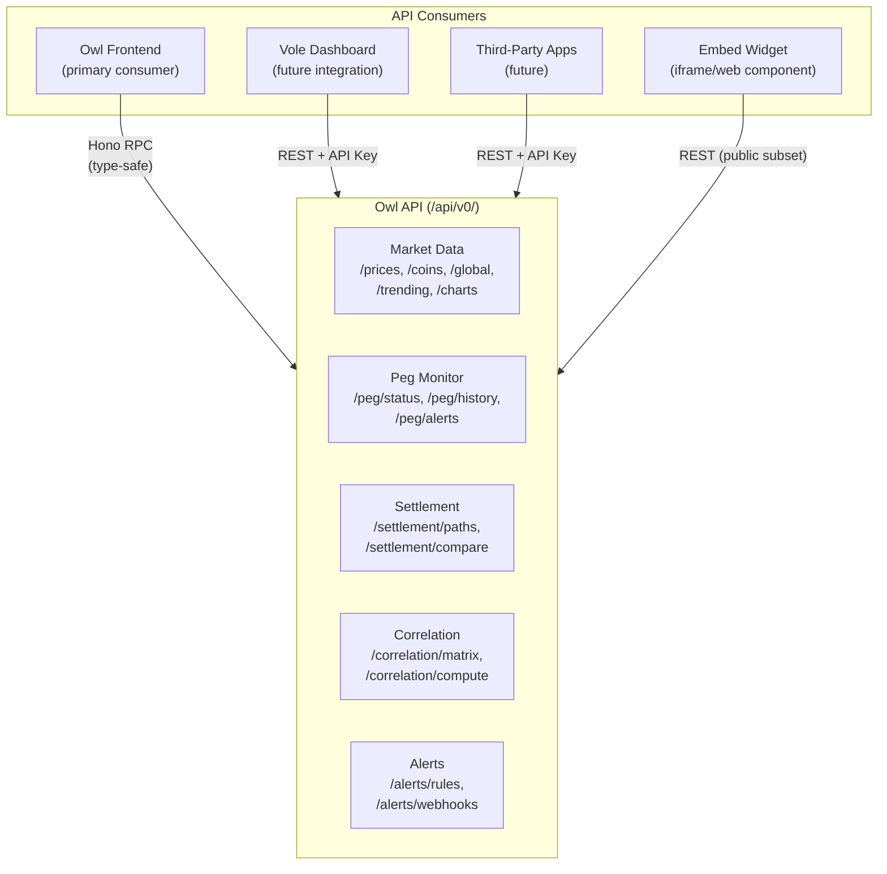
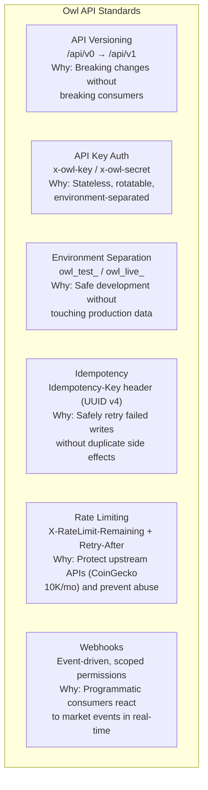
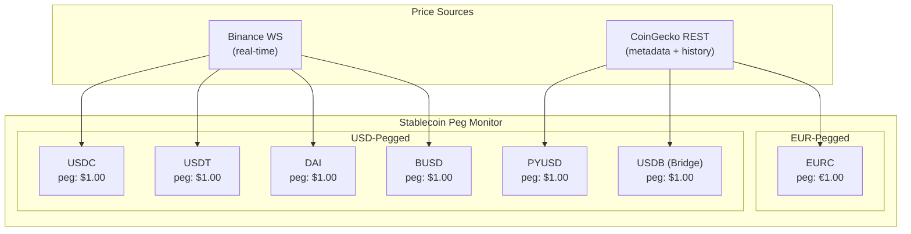
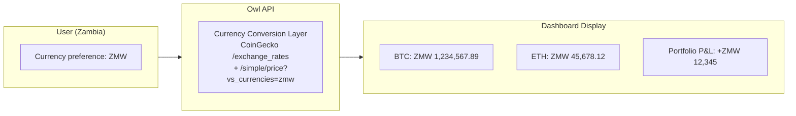
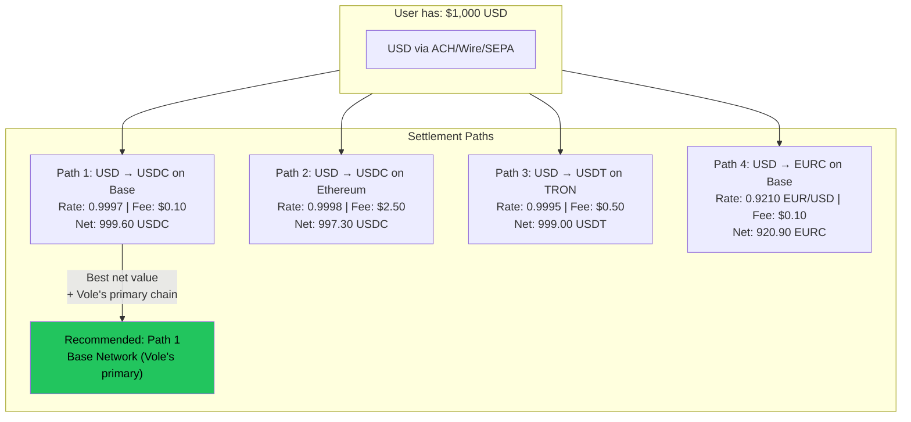
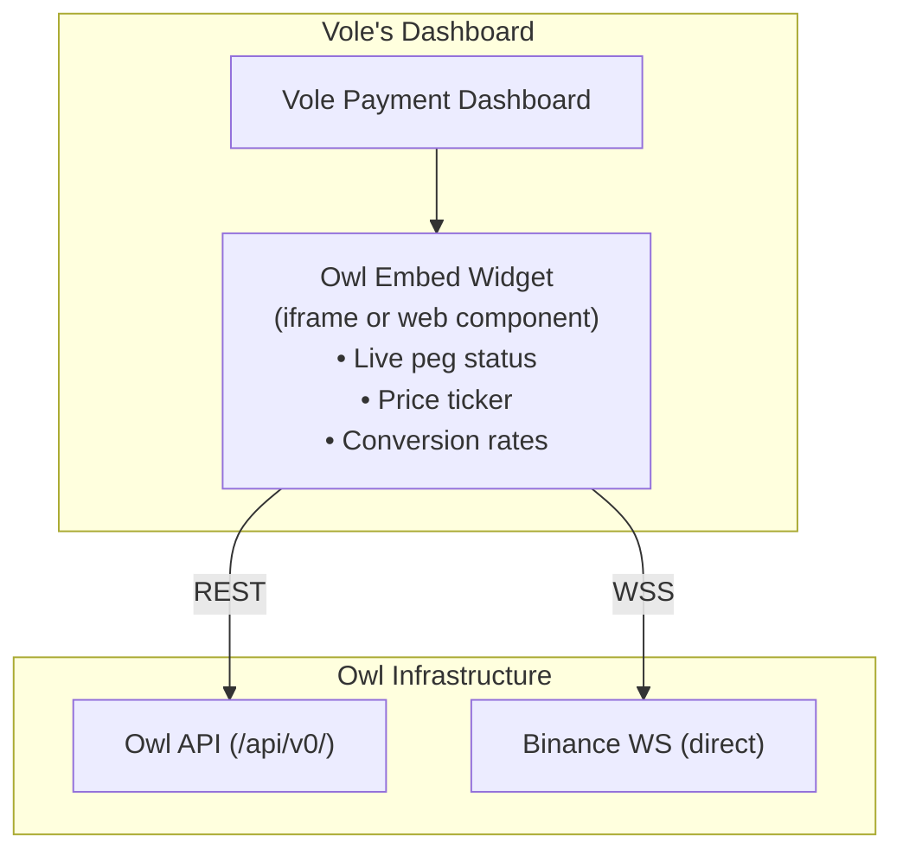
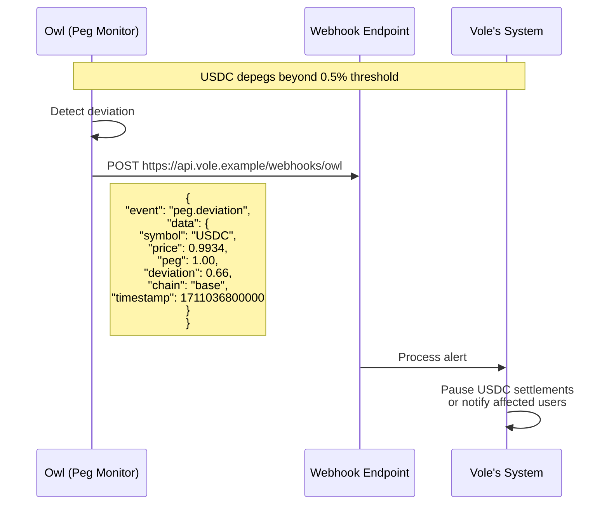
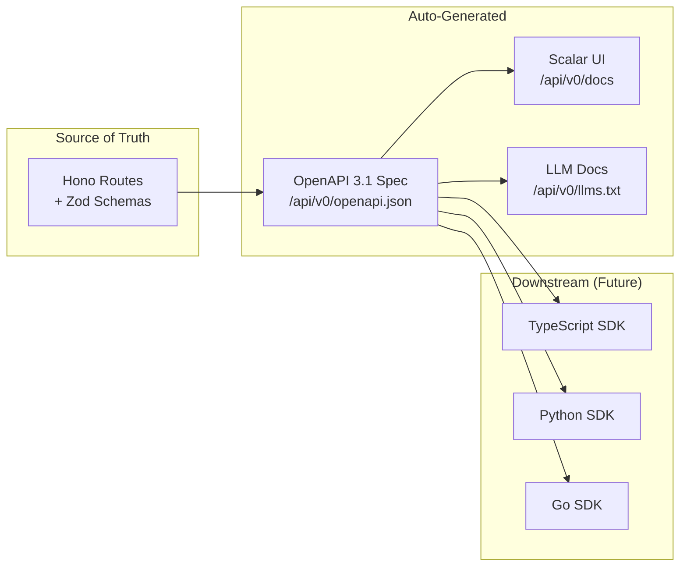

# ADR-004: Product Strategy

**Status:** Accepted
**Date:** 2026-03-21
**Decision Makers:** @mvula

## Context

Owl is not just a dashboard — it's a potential acquisition target for **Vole**, a YC-backed (F24) stablecoin-native cross-border payment infrastructure company. Vole enables African businesses, freelancers, and remote workers to receive international payments in USD/EUR and settle to stablecoins.

Every architectural and product decision in Owl is evaluated on one question first:

**Is this the right engineering decision?**

Vole compatibility is a secondary benefit, never the primary driver. A perfectly engineered product is more attractive than a copycat. We build better — not the same.

### What Vole Has (Public Intel)

| Layer | Detail |
|-------|--------|
| **Product** | Virtual USD/EUR accounts, payment links, product store, invoices, stablecoin wallets, mobile money exchange |
| **Infrastructure** | Next.js + Vercel + Cloudflare, API at `/v0`, Mintlify docs |
| **Settlement Partner** | Bridge (Stripe-owned) |
| **Stablecoins** | USDC, USDT, DAI, EURC, PYUSD, USDB (Bridge), BUSD |
| **Chains** | Ethereum, Polygon, BSC, Arbitrum, Base (primary), Bitcoin, TRON |
| **Fiat** | USD, EUR, GBP + 35 others. ACH, Wire, SEPA |
| **Market** | Zambia, Malawi (expanding across Africa) |
| **Team** | ~6 people, intentionally small, senior |
| **API Patterns** | Versioned (`/v0`), `x-client-key`/`x-client-secret` auth, test/live key split (`pk_test_`/`sk_test_`), idempotency headers (UUID v4, 24hr expiry), 100 req/min rate limiting, webhook system |

### What Vole Doesn't Have

Vole handles **payments and wallets** — not market intelligence. There is no:
- Real-time market data layer
- Stablecoin peg monitoring
- Cross-market correlation analysis
- Settlement path optimization based on live market conditions
- Embeddable market data widget
- Public market data API

**Owl fills this gap.**

---

## Decision

Owl will be built as a **production-grade market intelligence platform**. Every decision is made on independent engineering merit. Where our choices happen to be compatible with Vole's ecosystem, that's a strategic bonus — not the reason we made the choice.

---

## Product Strategy

### 1. API-First Architecture

Owl's Hono API is not just a "backend for the frontend." It's a **public-facing market data API** that Vole (or any integrator) could consume.

**Why API-first:**
- Owl's value is the data and intelligence, not the frontend. An API-first design means any consumer (our own UI, third-party dashboards, mobile apps, trading bots) can access the same capabilities.
- OpenAPI spec enables automatic SDK generation. Any integrator (including Vole, who uses OpenAPI-based SDK generation with their `saligen` tool) can generate a typed client in their language of choice.
- The frontend becomes a reference implementation, not the product itself. This is the difference between a project and a platform.

### 2. Production API Standards

A market data API handling financial information must follow established API design principles. These aren't novel — they're industry-standard patterns used by Stripe, Twilio, Coinbase, and every serious API product.

| Pattern | Implementation | Why (Independent Reasoning) |
|---------|---------------|---------------------------|
| API versioning | `/api/v0` prefix | We will make breaking changes. Versioning lets us iterate without destroying consumers. `/v0` signals pre-stable — when we're confident, we ship `/v1`. |
| API key auth | `x-owl-key` / `x-owl-secret` headers | Stateless authentication for machine-to-machine use. Keys are rotatable without session invalidation. Separate from user auth (Better Auth handles that). |
| Environment separation | `owl_test_` / `owl_live_` prefixed keys | Developers must be able to build integrations without hitting real market data endpoints. Test keys return mock/delayed data. Live keys hit real APIs. This is table stakes for any API product. |
| Idempotency | `Idempotency-Key` header, UUID v4, 24hr expiry | Write operations (create alert, add webhook) must be safely retryable. Network failures happen. Without idempotency, a retry creates duplicates. 24hr expiry prevents stale key conflicts. |
| Rate limiting | `X-RateLimit-Remaining` + `Retry-After` headers | We proxy CoinGecko (30 calls/min, 10K/mo). Uncontrolled API consumers could burn our upstream budget in hours. Rate limiting protects us and gives consumers clear signals to back off. |
| Webhooks | Event-driven with scope-based permissions | Email alerts are for humans. Webhooks are for systems. A trading bot or payment processor needs programmatic notification of peg deviations — not an email. Scoped permissions prevent webhook endpoints from receiving events they don't need. |
| Error format | RFC 7807 Problem Details JSON | Structured errors with `type`, `title`, `status`, `detail`, and `instance`. Industry standard. Machines parse it, humans read it. |

**Note on Vole compatibility:** Several of these patterns happen to align with Vole's API design. This is not because we copied them — it's because these are industry-standard patterns that any well-engineered API uses. The compatibility is a natural consequence of both products following good API design principles.

### 3. Full Stablecoin Coverage

Vole supports 7 stablecoins. Owl's peg monitor must track all of them — not just USDC/USDT.

**Why this matters:**
- USDB is Bridge's stablecoin. Vole uses Bridge for settlement. Monitoring USDB's peg is directly relevant to Vole's operations.
- EURC is EUR-pegged, not USD-pegged. Multi-peg logic shows we understand the nuance of Vole's dual-currency (USD/EUR) model.
- If any of these depegs, Vole's users are directly affected. Owl becomes a real-time risk monitoring tool.

### 4. Multi-Currency Awareness

Vole's users operate in ZAR, NGN, ZMW (Zambian Kwacha), MWK (Malawian Kwacha), and 30+ other currencies. Owl should present data in the user's local currency, not just USD.

**Data model impact:**
- User table gets a `preferredCurrency` field (default: USD)
- All price displays are converted client-side using cached exchange rates
- Portfolio P&L calculated in the user's preferred currency
- CoinGecko `/simple/price` supports `vs_currencies` param with 50+ fiat codes

### 5. Multi-Chain Settlement Optimization

Vole operates on 7 chains. Stablecoin conversion rates vary by chain. The settlement optimizer should show which chain offers the best rate.

**Why multi-chain matters:**
- Gas fees vary dramatically (Ethereum $2-20 vs Base/TRON $0.01-0.50)
- The same stablecoin can trade at slightly different prices across chains
- Vole's primary chain is Base — the optimizer should weight this
- This is the kind of intelligence Vole's users need but don't currently have

### 6. Embed Widget

A lightweight, embeddable version of the peg monitor and price ticker that Vole (or anyone) can drop into their dashboard.

**Implementation:**
- Separate lightweight build (React component or web component)
- Configurable: which stablecoins, which currencies, theme (light/dark)
- Loads from Owl's CDN, calls Owl's API
- Mirrors Vole's own embed widget pattern ("few lines of code")

**Staged delivery:** This is a late-stage feature (post-MVP). Design the API to support it from day 1, build the widget later.

### 7. Webhook-Based Alerts

Beyond email and in-app notifications, Owl should push alerts via **webhooks** — enabling programmatic consumers (like Vole) to react to market events.

**Why webhooks matter for Vole:**
- Vole processes real money. A stablecoin depeg affects their settlement operations.
- Automated webhook → Vole can programmatically pause affected conversion paths
- This is the integration point that makes Owl operationally critical, not just informational

---

## Revised Feature Scope

| Feature | Original Scope | With Vole Alignment |
|---------|---------------|-------------------|
| Dashboard | USD prices | Multi-currency (35+ fiats), user-preferred currency |
| Portfolio tracker | Holdings in USD | Multi-currency holdings and P&L |
| Peg monitor | USDC, USDT | All 7 stablecoins (USDC, USDT, DAI, EURC, PYUSD, USDB, BUSD), multi-peg (USD + EUR) |
| Settlement optimizer | Fiat vs stablecoin | Multi-currency, multi-chain (7 chains), gas fee comparison, Base prioritized |
| Correlation engine | BTC vs NASDAQ | Same (no change) |
| Alerts | Email + in-app | + Webhook delivery for programmatic consumers |
| **NEW** | — | Public API (`/api/v0/`) with OpenAPI spec, API keys, rate limiting |
| **NEW** | — | Embed widget (peg monitor / price ticker) |
| **NEW** | — | Webhook system (peg alerts, price alerts) |
| **NEW** | — | Audit logging (who queried what, when) |
| **NEW** | — | LLM-friendly API docs (`/llms.txt`) |

---

## Additional Engineering Decisions

### 8. Monitoring & Status

A financial data platform without uptime monitoring is amateur hour. Users and API consumers need to know if the service is degraded.

**Decision:**
- Health check endpoints: `/api/v0/health` (authenticated, detailed) and `/api/v0/health/public` (unauthenticated, simple status)
- Status page for public-facing uptime visibility
- Uptime monitoring on critical paths: API availability, Binance WS connection, Finnhub relay (CF DO), CoinGecko reachability

**Why:** If a stablecoin depegs at 2am and our peg monitor is down without anyone knowing, the entire product's value proposition is destroyed. Monitoring isn't optional for financial data.

**Tooling decision deferred to ADR-005.** Better Stack, Checkly, or self-hosted — evaluated on merit, not on what Vole uses.

### 9. Audit Logging

Every API request should be traceable. For a financial data product, this isn't just good engineering — it's expected.

**What we log:**
- API key used (hashed, never plaintext)
- Endpoint called
- Timestamp
- Response status
- IP address (hashed for privacy)
- Rate limit state at time of request

**What we don't log:**
- Full request/response bodies (privacy + storage cost)
- User browsing behavior on the frontend (not our business)

**Why:** If an API consumer reports incorrect data delivery, we need to trace exactly what happened. If we detect abuse, we need evidence. If Owl is ever evaluated for acquisition, audit logging signals operational maturity.

**Storage:** Append-only table in Postgres. Retention: 90 days. Older logs archived or purged. This is a simple `INSERT` on every API request — no complex infrastructure needed.

### 10. SDK Generation Strategy

Owl exposes an OpenAPI 3.1 spec auto-generated from Hono route definitions via `@hono/zod-openapi`. This spec is the single source of truth.

**Why auto-generated:**
- Docs that drift from code are worse than no docs. Auto-generation makes drift impossible.
- The OpenAPI spec is machine-readable. Any tool (Postman, Insomnia, `openapi-generator`, Vole's `saligen`) can consume it.
- SDK generation is a `npx openapi-generator-cli generate` command away. We don't need to build SDKs now — we need to make it trivial to build them later.

### 11. LLM-Friendly Documentation

Serve a `/api/v0/llms.txt` endpoint — a plaintext, structured summary of the API designed for consumption by AI tools and coding assistants.

**Why:** Developers increasingly use AI to integrate APIs. An LLM-consumable doc means a developer can paste our `/llms.txt` into their AI tool and get working integration code immediately. This is a competitive moat that 99% of API products don't have yet.

**Implementation:** Generated from the same OpenAPI spec. One extra route, zero maintenance overhead.

### 12. Sandbox / Test Mode

API keys prefixed with `owl_test_` activate test mode:

| Behavior | Test Mode | Live Mode |
|----------|----------|-----------|
| Market data | Deterministic mock data (not random — reproducible) | Real-time from Binance/Finnhub/CoinGecko |
| Peg deviations | Simulated deviations on a schedule (for testing alerts) | Real market data |
| Rate limits | Same limits as production (catches bugs early) | Same |
| Webhooks | Delivered to test endpoint, logged in dashboard | Delivered to production endpoint |
| Database | Isolated test schema or flag | Production schema |

**Why not just "use production with low rate limits"?**
- Developers need predictable data to write tests. Real market data is unpredictable.
- Simulated peg deviations let consumers test their alert handling without waiting for an actual depeg.
- Isolated test mode prevents accidental pollution of production data.

---

## Revised Staged Implementation

| Stage | Feature | What Ships |
|-------|---------|-----------|
| **1** | Scaffold + Auth + DB | Next.js + Hono mounted, Better Auth, Drizzle + Supabase Postgres, API versioning (`/v0`), rate limiting middleware, health endpoints, audit logging table |
| **2** | Market Data + Dashboard | CoinGecko integration with caching, coin list + search, global stats, trending, multi-currency support (user preference), coin detail with charts |
| **3** | Real-Time Prices | Binance direct WS from browser, Finnhub relay on CF DO (lazy connection), client-side normalizer, live ticker, reconnection logic |
| **4** | Portfolio Tracker | CRUD portfolios/holdings, multi-currency P&L calculation, unified stock + crypto view |
| **5** | Watchlists + Alerts | Watchlist CRUD, alert rules, in-app notifications, email via Resend, **webhook delivery** |
| **6** | Peg Monitor | All 7 stablecoins, multi-peg (USD + EUR), deviation threshold alerts, historical deviation charts |
| **7** | Correlation Engine | Cross-market correlation (BTC vs NASDAQ, ETH vs tech), correlation matrix, configurable time windows |
| **8** | Settlement Optimizer | Multi-currency paths, multi-chain comparison (7 chains, Base prioritized), gas fee analysis |
| **9** | Public API + Docs | API key management (test/live), OpenAPI spec + Scalar UI, `/llms.txt`, sandbox test mode |
| **10** | Embed Widget | Lightweight peg monitor / price ticker, configurable, iframe or web component |

---

## Consequences

### Positive
- **Standalone value:** Every feature is useful to any user, regardless of Vole
- **API-first:** Owl's value is in the data layer, not locked in a frontend
- **Production-grade:** Audit logging, rate limiting, idempotency, monitoring, test mode — these signal operational maturity
- **Webhook system:** Makes Owl programmatically consumable, not just a visual dashboard
- **Multi-currency/multi-chain:** Serves a global audience, not just US/USD users
- **Vole compatibility:** Natural consequence of good engineering, not the goal

### Negative
- Scope is larger — more features to build and maintain
- API key management and rate limiting add complexity to stage 1
- Multi-currency adds complexity to every price display
- 7 stablecoins × multiple chains = more data to monitor and cache
- Audit logging adds a write to every API request (mitigated: async insert, minimal overhead)

### Risks
- USDB and PYUSD may have limited Binance/CoinGecko coverage (needs verification in implementation)
- Sandbox/test mode adds a parallel code path that must stay in sync with production behavior
- Scope creep — 10 stages is ambitious for a solo dev. Stages 1-6 are the MVP. Stages 7-10 are the platform play.

## Related Decisions
- [ADR-001: API Provider Selection](./001-api-provider-selection.md)
- [ADR-002: System Architecture](./002-system-architecture.md)
- [ADR-003: WebSocket Hosting Decision](./003-websocket-hosting.md)
- ADR-005: Tech Stack Choices — pending
