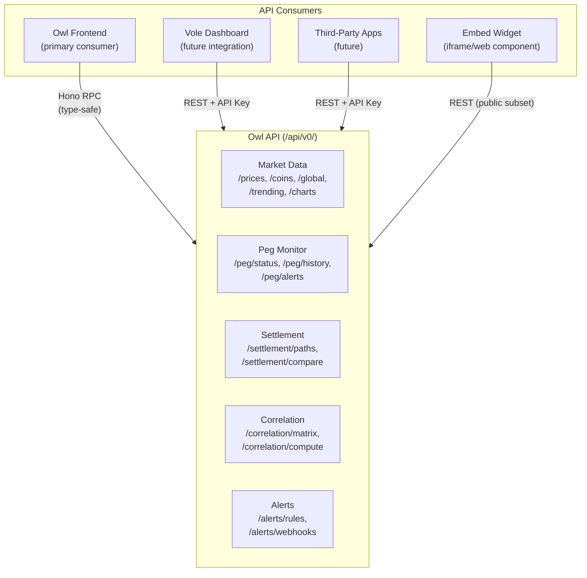
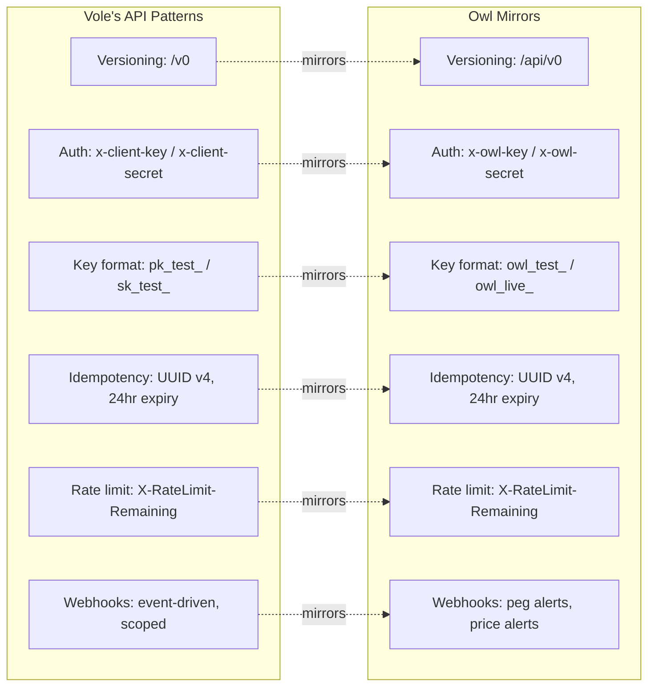
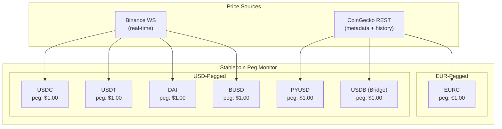
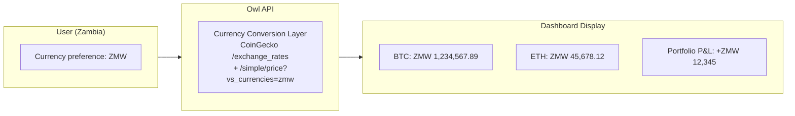
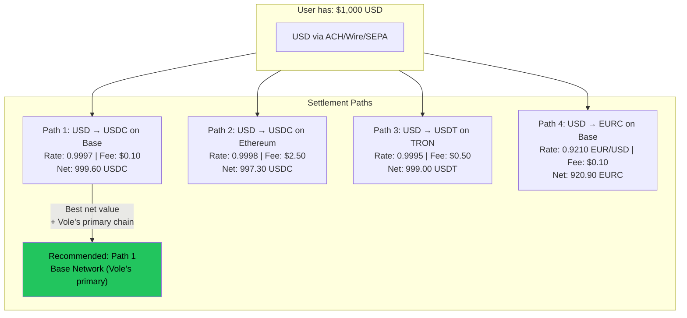
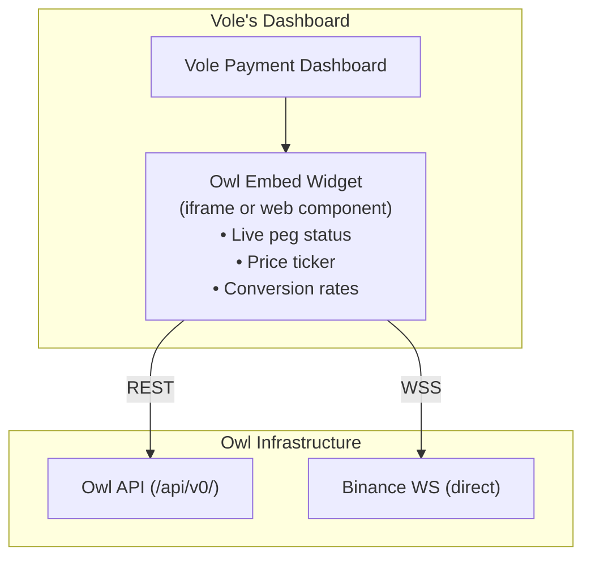
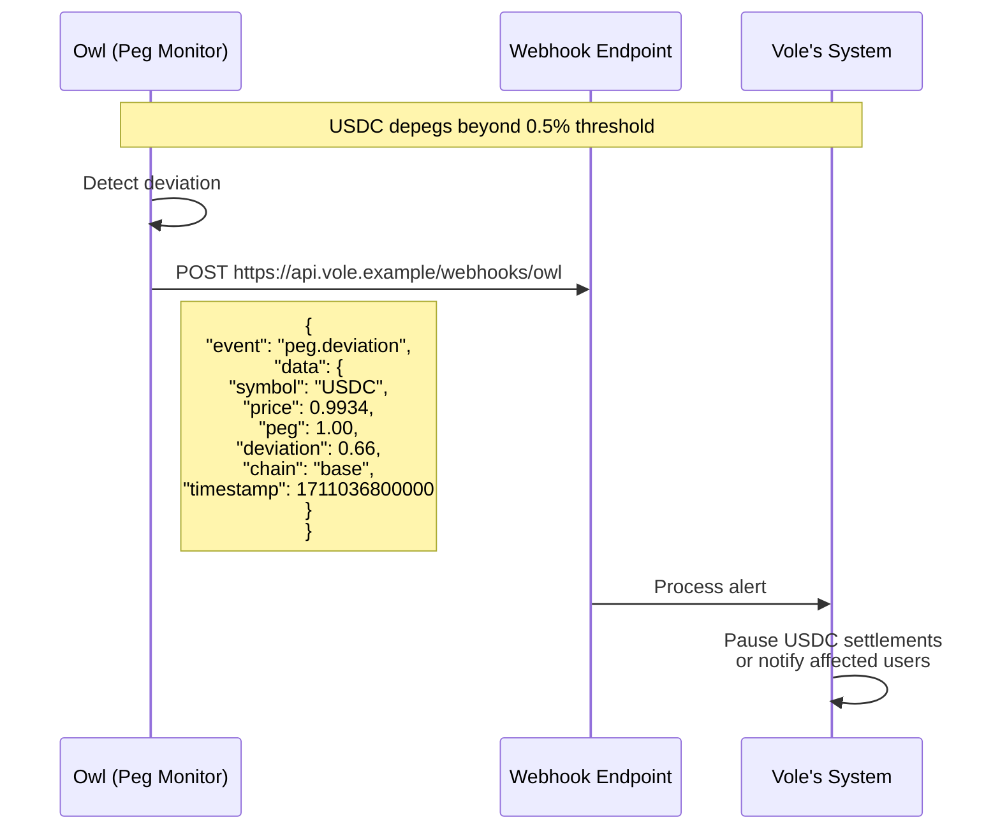

# ADR-004: Product Strategy & Vole Alignment

**Status:** Accepted
**Date:** 2026-03-21
**Decision Makers:** @mvula

## Context

Owl is not just a dashboard — it's a potential acquisition target for **Vole**, a YC-backed (F24) stablecoin-native cross-border payment infrastructure company. Vole enables African businesses, freelancers, and remote workers to receive international payments in USD/EUR and settle to stablecoins.

Every architectural and product decision in Owl must be evaluated against two questions:
1. Does this make Owl useful as a standalone product?
2. Does this make Owl attractive as an integration or acquisition for Vole?

### What Vole Has (Public Intel)

| Layer | Detail |
|-------|--------|
| **Product** | Virtual USD/EUR accounts, payment links, product store, invoices, stablecoin wallets, mobile money exchange |
| **Infrastructure** | Next.js + Vercel + Cloudflare, API at `/v0`, Mintlify docs |
| **Settlement Partner** | Bridge (Stripe-owned) |
| **Stablecoins** | USDC, USDT, DAI, EURC, PYUSD, USDB (Bridge), BUSD |
| **Chains** | Ethereum, Polygon, BSC, Arbitrum, Base (primary), Bitcoin, TRON |
| **Fiat** | USD, EUR, GBP + 35 others. ACH, Wire, SEPA |
| **Market** | Zambia, Malawi (expanding across Africa) |
| **Team** | ~6 people, intentionally small, senior |
| **API Patterns** | Versioned (`/v0`), `x-client-key`/`x-client-secret` auth, test/live key split (`pk_test_`/`sk_test_`), idempotency headers (UUID v4, 24hr expiry), 100 req/min rate limiting, webhook system |

### What Vole Doesn't Have

Vole handles **payments and wallets** — not market intelligence. There is no:
- Real-time market data layer
- Stablecoin peg monitoring
- Cross-market correlation analysis
- Settlement path optimization based on live market conditions
- Embeddable market data widget
- Public market data API

**Owl fills this gap.**

---

## Decision

Owl will be built as a **market intelligence platform** with an API-first architecture that mirrors Vole's engineering patterns. The product should be useful standalone but designed for seamless integration into Vole's ecosystem.

---

## Product Strategy

### 1. API-First Architecture

Owl's Hono API is not just a "backend for the frontend." It's a **public-facing market data API** that Vole (or any integrator) could consume.

**Why API-first matters for Vole:**
- Vole's team generates SDKs from OpenAPI specs (their `saligen` tool). If Owl exposes an OpenAPI spec, Vole can generate an Owl SDK in 7 languages using their existing toolchain — zero integration friction.
- Vole's dashboard could embed Owl data with a few API calls, no UI migration needed.
- API-first means Owl's value isn't locked in the frontend — it's in the data layer.

### 2. Matching Vole's API Patterns

Adopting Vole's exact API conventions reduces integration friction to near-zero.

| Pattern | Vole Implementation | Owl Implementation | Why Mirror |
|---------|-------------------|-------------------|-----------|
| API versioning | `/v0` | `/api/v0` | Same migration story, same breaking-change discipline |
| Auth headers | `x-client-key` / `x-client-secret` | `x-owl-key` / `x-owl-secret` | Ops team recognizes the pattern instantly |
| Key prefixes | `pk_test_` / `sk_test_` / `pk_live_` / `sk_live_` | `owl_test_` / `owl_live_` | Same key management UX, same env var conventions |
| Idempotency | `Idempotency-Key` header, UUID v4, 24hr expiry | Identical | Same middleware can validate both APIs |
| Rate limiting | 100 req/min, `X-RateLimit-Remaining` + `Retry-After` | Same headers, configurable limits | Same client retry logic works for both |
| Webhooks | Event-driven, scope-based permissions | Same structure for peg/price alerts | Vole's webhook infrastructure can consume Owl events |
| Error format | Standard HTTP codes + JSON error body | Match structure | Same error handling in client SDKs |

### 3. Full Stablecoin Coverage

Vole supports 7 stablecoins. Owl's peg monitor must track all of them — not just USDC/USDT.

**Why this matters:**
- USDB is Bridge's stablecoin. Vole uses Bridge for settlement. Monitoring USDB's peg is directly relevant to Vole's operations.
- EURC is EUR-pegged, not USD-pegged. Multi-peg logic shows we understand the nuance of Vole's dual-currency (USD/EUR) model.
- If any of these depegs, Vole's users are directly affected. Owl becomes a real-time risk monitoring tool.

### 4. Multi-Currency Awareness

Vole's users operate in ZAR, NGN, ZMW (Zambian Kwacha), MWK (Malawian Kwacha), and 30+ other currencies. Owl should present data in the user's local currency, not just USD.

**Data model impact:**
- User table gets a `preferredCurrency` field (default: USD)
- All price displays are converted client-side using cached exchange rates
- Portfolio P&L calculated in the user's preferred currency
- CoinGecko `/simple/price` supports `vs_currencies` param with 50+ fiat codes

### 5. Multi-Chain Settlement Optimization

Vole operates on 7 chains. Stablecoin conversion rates vary by chain. The settlement optimizer should show which chain offers the best rate.

**Why multi-chain matters:**
- Gas fees vary dramatically (Ethereum $2-20 vs Base/TRON $0.01-0.50)
- The same stablecoin can trade at slightly different prices across chains
- Vole's primary chain is Base — the optimizer should weight this
- This is the kind of intelligence Vole's users need but don't currently have

### 6. Embed Widget

A lightweight, embeddable version of the peg monitor and price ticker that Vole (or anyone) can drop into their dashboard.

**Implementation:**
- Separate lightweight build (React component or web component)
- Configurable: which stablecoins, which currencies, theme (light/dark)
- Loads from Owl's CDN, calls Owl's API
- Mirrors Vole's own embed widget pattern ("few lines of code")

**Staged delivery:** This is a late-stage feature (post-MVP). Design the API to support it from day 1, build the widget later.

### 7. Webhook-Based Alerts

Beyond email and in-app notifications, Owl should push alerts via **webhooks** — enabling programmatic consumers (like Vole) to react to market events.

**Why webhooks matter for Vole:**
- Vole processes real money. A stablecoin depeg affects their settlement operations.
- Automated webhook → Vole can programmatically pause affected conversion paths
- This is the integration point that makes Owl operationally critical, not just informational

---

## Revised Feature Scope

| Feature | Original Scope | With Vole Alignment |
|---------|---------------|-------------------|
| Dashboard | USD prices | Multi-currency (35+ fiats), user-preferred currency |
| Portfolio tracker | Holdings in USD | Multi-currency holdings and P&L |
| Peg monitor | USDC, USDT | All 7 stablecoins (USDC, USDT, DAI, EURC, PYUSD, USDB, BUSD), multi-peg (USD + EUR) |
| Settlement optimizer | Fiat vs stablecoin | Multi-currency, multi-chain (7 chains), gas fee comparison, Base prioritized |
| Correlation engine | BTC vs NASDAQ | Same (no change) |
| Alerts | Email + in-app | + Webhook delivery for programmatic consumers |
| **NEW** | — | Public API (`/api/v0/`) with OpenAPI spec, API keys, rate limiting |
| **NEW** | — | Embed widget (peg monitor / price ticker) |
| **NEW** | — | Webhook system (peg alerts, price alerts) |

---

## Revised Staged Implementation

| Stage | Feature | Vole Alignment |
|-------|---------|---------------|
| **1** | Scaffold + Auth + DB | API versioning (`/v0`), rate limiting middleware, idempotency middleware |
| **2** | Market Data + Dashboard | Multi-currency support, CoinGecko exchange rates, user currency preference |
| **3** | Real-Time Prices | Binance direct + CF DO relay. Peg monitoring for all 7 stablecoins |
| **4** | Portfolio Tracker | Multi-currency holdings and P&L |
| **5** | Watchlists + Alerts | Alert rules + **webhook delivery** |
| **6** | Peg Monitor | Full peg dashboard, multi-peg (USD + EUR), deviation history |
| **7** | Correlation Engine | Same |
| **8** | Settlement Optimizer | Multi-currency, multi-chain, gas comparison, Base prioritized |
| **9** | Public API + Docs | OpenAPI spec via `@hono/zod-openapi`, Scalar UI, API key management |
| **10** | Embed Widget | Lightweight peg monitor / ticker for third-party embedding |

---

## Consequences

### Positive
- Owl fills an explicit gap in Vole's product (market intelligence)
- Matching API patterns means near-zero integration friction
- API-first design means Owl's value extends beyond the frontend
- Webhook system makes Owl operationally critical (not just informational)
- Multi-currency/multi-chain awareness demonstrates deep understanding of Vole's domain

### Negative
- Scope is larger — more features to build and maintain
- API key management and rate limiting add complexity to stage 1
- Multi-currency adds complexity to every price display
- 7 stablecoins × multiple chains = more data to monitor and cache

### Risks
- Over-optimizing for Vole at the expense of standalone product value (mitigated: all features are useful to any user, not just Vole)
- Vole's API patterns may change (mitigated: our patterns are sensible engineering regardless)
- USDB and PYUSD may have limited Binance/CoinGecko coverage (needs verification)

## Related Decisions
- [ADR-001: API Provider Selection](./001-api-provider-selection.md)
- [ADR-002: System Architecture](./002-system-architecture.md)
- [ADR-003: WebSocket Hosting Decision](./003-websocket-hosting.md)
- ADR-005: Tech Stack Choices — pending
