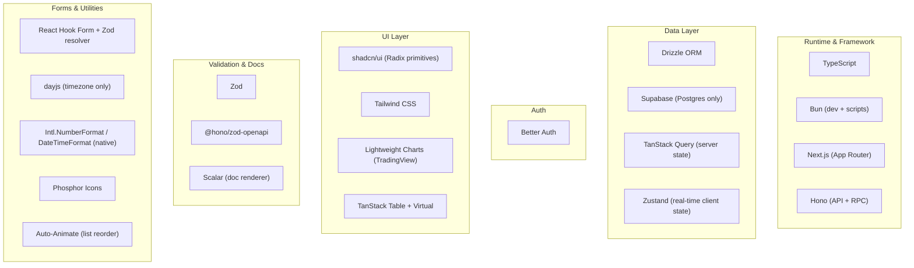

# ADR-005: Tech Stack Choices

**Status:** Accepted
**Date:** 2026-03-21
**Decision Makers:** @mvula

## Context

Every tool in Owl's stack must justify its presence with clear engineering reasoning. No tool is chosen because it's popular, because a target company uses it, or because it's the default. Every kilobyte shipped to the client must earn its place.

**Total client JS budget target: <250 KB gzipped** for a real-time financial platform. For context, the average SaaS app ships 500KB-1MB+.

---

## Performance Philosophy

Every decision in this stack is guided by a server-first, zero-bloat philosophy aligned with how the fastest production Next.js applications are built. The reference implementation is [NextFaster](https://github.com/ethanniser/NextFaster) — a performance-obsessed e-commerce template co-built by Rhys Sullivan (Vercel engineer, Domains team) that served 1M+ page views with excellent PageSpeed scores.

### Core Principles

**1. Server-first rendering. Client JS is a tax.**

Every component defaults to a Server Component. The `'use client'` directive is only added when a component needs interactivity (WebSocket subscription, click handler, form input). Static content — coin metadata, page shells, navigation, labels — renders on the server and ships as HTML. Zero JS for content that doesn't change on the client.

This is not an optimization — it's the architectural default. The question is never "should this be a Server Component?" It's "does this need to be a Client Component, and why?"

**2. The fastest code is code that doesn't ship.**

Before adding a library, ask: can native browser APIs handle this? `Intl.NumberFormat` handles 35+ currencies at 0 KB. `Intl.DateTimeFormat` handles timezone display at 0 KB. CSS `@keyframes` handles price flash animations at 0 KB. The View Transitions API handles page transitions at 0 KB. Libraries are for problems the platform cannot solve.

**3. Streaming and Partial Prerendering.**

The dashboard page shell (sidebar, layout, headers) is pre-rendered at the edge and served statically. Dynamic content (live prices, portfolio P&L, peg status) streams in after the shell loads. The user sees a complete layout instantly — data fills in progressively. This is Next.js Partial Prerendering and it eliminates perceived load time.

**4. The real-time hot path bypasses React.**

For the most latency-sensitive updates (price cells updating 50 times/sec), the correct pattern is `useRef` + direct DOM `textContent` mutation. React's reconciler is not involved. This is what Binance, Coinbase, and Robinhood do for their ticker displays. React handles mount/unmount lifecycle; the browser handles the frame-by-frame number update.

```typescript
// The escape hatch — React is not in the hot path
const priceRef = useRef<HTMLSpanElement>(null)

useEffect(() => {
  const unsub = priceStore.subscribe(
    (state) => state.prices.get(symbol),
    (price) => {
      if (priceRef.current) {
        priceRef.current.textContent = formatPrice(price)
      }
    }
  )
  return unsub
}, [symbol])

return <span ref={priceRef} className="tabular-nums">0.00</span>
```

**5. Every dependency is a liability.**

Each npm package is a maintenance burden, a security surface, a bundle cost, and a breaking-change risk. The stack has 12 runtime dependencies (excluding React/Next.js). Each one was evaluated against "can we do this without a library?" and survived only if the answer was "not without reimplementing significant, battle-tested logic."

**6. Measure, don't assume.**

No performance claim in this document is accepted without a mechanism to verify it. Before each stage ships:
- Lighthouse CI in the deployment pipeline
- Bundle analysis via `@next/bundle-analyzer`
- React Profiler recordings for real-time update paths
- Web Vitals monitoring (LCP, INP, CLS) in production

If a library degrades Web Vitals, it gets replaced. Performance is a feature, not a goal that gets deprioritized.

---

## Stack Overview



---

## Bundle Budget

| Category | Library | Gzipped | Justification |
|----------|---------|--------:|--------------|
| Charts (main) | Lightweight Charts | ~170 KB | The product IS the charts. Native candlestick, 200+ updates/sec, market hours gaps. |
| Tables | TanStack Table + Virtual | ~20 KB | Column management, sort/filter state machine, virtualization. |
| Server state | TanStack Query | ~14 KB | Cache, refetch, optimistic updates for REST data. |
| Forms | RHF + Zod resolver | ~11.5 KB | Uncontrolled inputs, Zod already amortized. |
| Client state | Zustand | ~1.2 KB | Real-time WS prices, UI state. `useSyncExternalStore` = no tearing. |
| Dates (timezone) | dayjs utc + timezone | ~3 KB | Market hours conversion (EST/CET/EAT) only. |
| List animations | Auto-Animate | ~1.9 KB | Watchlist reorder, item add/remove. |
| Icons | Phosphor Icons | ~0.5-0.9 KB/icon | Tree-shakeable, 6 weights, ~9,000 icons. |
| UI primitives | shadcn/ui (Radix) | ~0 KB runtime | Copy-paste, not npm. Radix primitives are peer deps of shadcn components we use. |
| Sparklines | Custom SVG | 0 KB | 30-40 lines of React. No library. |
| Number formatting | Intl.NumberFormat | 0 KB | Native API, handles 35+ currencies. |
| Date formatting | Intl.DateTimeFormat | 0 KB | Native API. |
| CSS | Tailwind | 0 KB runtime | Build-time only. |
| Validation | Zod | ~14 KB | Shared: API validation + form validation + OpenAPI generation. |
| **TOTAL** | | **~248 KB** | |

---

## Decisions With Full Reasoning

### 1. TypeScript

**Decision:** TypeScript everywhere — frontend, API, database schema, WebSocket messages, shared types.

**Why:** The unified `MarketUpdate` type flows from Binance WebSocket → client-side normalizer → Jotai atom → PriceDisplay component → formatted output. A type error at any boundary is a financial data display bug. TypeScript catches these at compile time.

**What we considered:** Nothing. This is non-negotiable for a financial data product.

---

### 2. Bun

**Decision:** Bun as the development runtime and script runner. Production runs on Vercel (Node under the hood) and Cloudflare Workers (V8).

**Why:**
- Native TypeScript execution — no build step for server code in development
- Faster package installs than npm/yarn/pnpm
- Built-in test runner
- `bun run` for scripts is faster than `npx`

**What we considered:**
- **Node.js:** Slower TypeScript execution in dev (needs tsx or ts-node). Production is Node anyway (Vercel). Bun gives us dev speed without affecting production.
- **Deno:** Better security model but worse npm compatibility. The ecosystem we need (Next.js, Hono, Drizzle) is npm-first.

**Trade-off acknowledged:** Bun is not the production runtime. Vercel runs Node. The Cloudflare relay runs V8. Bun is dev-only. We accept this — the dev speed gain is worth it, and there's no Bun-specific API in our code.

---

### 3. Next.js (App Router)

**Decision:** Next.js with App Router as the frontend framework. Hono handles all API logic — Next.js does not serve API routes directly.

**Why:**
- Server Components for static/slow-updating content (coin metadata pages, market overview shell, settings)
- Streaming / Partial Prerendering — page shell loads instantly from edge, real-time data streams in
- File-based routing with layouts — dashboard layout persists across route changes
- Built-in image optimization, font loading (JetBrains Mono), metadata API
- Vercel deployment is first-class (and aligns with Vole's stack)

**Why not a Vite React SPA?**
- Loses Server Components — coin metadata pages would need client-side fetch + loading states instead of server-rendered HTML
- Loses streaming — the dashboard shell can't be pre-rendered at the edge
- SEO for public pages (market overview, coin detail) requires SSR or SSG
- Vite + Hono standalone would work but adds deployment complexity (two separate builds)

**Why Next.js is purely the frontend:**
- Hono is mounted at `app/api/[[...route]]/route.ts` — a catch-all that delegates all API logic to Hono
- Next.js API routes are not used directly — they're just the mount point
- This means the API is portable — Hono can be extracted to standalone if needed

---

### 4. Hono (API + RPC)

**Decision:** Hono as the API framework, mounted inside Next.js, with Hono RPC for type-safe client calls.

**Why Hono over tRPC:**
| | Hono RPC | tRPC |
|--|---------|------|
| Bundle size (client) | ~2 KB | ~12 KB |
| OpenAPI spec generation | Native via `@hono/zod-openapi` | Requires `trpc-openapi` adapter |
| HTTP standards | Standard REST routes, standard HTTP methods | Custom protocol over HTTP |
| External API consumers | Any HTTP client can call it | Requires tRPC client |
| Edge runtime | First-class (Cloudflare Workers, Vercel Edge) | Works but not edge-native |
| Type safety | End-to-end via RPC client | End-to-end via tRPC client |

**The decisive factor:** Owl's API must be consumable by external clients (Vole, third-party apps, SDKs). tRPC's custom protocol means external consumers need a tRPC client. Hono serves standard HTTP endpoints that anything can call, while still giving us type-safe RPC for our own frontend.

**Why Hono over Express:**
- Express doesn't run on edge runtimes (Cloudflare Workers, Vercel Edge)
- No built-in RPC or type inference
- No OpenAPI integration
- ~500 KB vs Hono's ~14 KB

**Why mount inside Next.js instead of standalone:**
- Single deployment to Vercel
- Shared environment variables
- No CORS configuration (same origin)
- The API is still portable — the Hono app is defined in `server/api/`, not coupled to Next.js

---

### 5. Drizzle ORM

**Decision:** Drizzle as the ORM for Supabase Postgres.

**Why Drizzle over Prisma:**
| | Drizzle | Prisma |
|--|---------|--------|
| Bundle size | ~40 KB | ~800 KB+ (engine binary) |
| Query style | SQL-like (you think in SQL) | Abstracted (its own query language) |
| Serverless cold start | Fast (pure JS) | Slow (loads binary engine) |
| Generated SQL visibility | 1:1 with what you write | Opaque, sometimes generates N+1 |
| Edge runtime | Works | Requires Prisma Accelerate or Data Proxy |
| Type safety | Full, inferred from schema | Full, generated from schema |
| Migrations | SQL-based, reviewable | Custom migration format |

**The decisive factors:**
1. **Serverless cold start.** Prisma loads a binary engine on each cold start. On Vercel's free tier (300s max), this eats into response time. Drizzle is pure JS — negligible startup cost.
2. **SQL transparency.** For a financial app, we need to know exactly what queries hit the database. Drizzle's SQL-like API produces predictable, inspectable SQL. Prisma's abstraction can generate unexpected queries.
3. **Edge compatibility.** Drizzle works on Cloudflare Workers. Prisma requires Data Proxy or Accelerate.

**Why not raw SQL with `postgres.js`:**
- We'd lose type-safe schema definitions and migration generation
- Drizzle's schema IS the type system — `typeof schema.holding.$inferSelect` gives us the TypeScript type for free
- The overhead is ~40 KB. For what it provides, this is justified.

**NextFaster (Rhys Sullivan's project at Vercel) also uses Drizzle** for exactly these reasons — performance-first, SQL-transparent, serverless-friendly.

---

### 6. Supabase (Postgres Only)

**Decision:** Supabase as a managed Postgres host. We use ONLY the database — no auth, no storage, no realtime, no edge functions.

**Why Supabase over Neon:**
| | Supabase | Neon |
|--|---------|------|
| Free tier | 500 MB, 2 projects | 512 MB, 1 project |
| Connection pooling | Supavisor (built-in) | Built-in |
| Branching | No | Yes (preview branches) |
| Dashboard | Full Postgres admin | Simpler |
| Drizzle support | First-class | First-class |

**Honest assessment:** Neon and Supabase are nearly equivalent for our use case. Supabase was chosen because:
1. Connection pooling via Supavisor works well with serverless (Vercel functions)
2. The dashboard is useful for quick queries during development
3. Free tier allows 2 projects (production + staging)

**Why not Railway Postgres:** Railway's Postgres is tied to their platform. Supabase is standalone — if we migrate hosting, the database doesn't move with it.

**Why not PlanetScale:** PlanetScale is MySQL-based. We use Postgres for JSON operators, array types, and Drizzle's Postgres-specific features.

**Why "Postgres only":** Supabase Auth competes with Better Auth. Supabase Realtime competes with our WebSocket architecture. Supabase Storage is not needed. Using multiple overlapping services from one vendor creates coupling and confusion. We use Supabase for one thing, and it does that thing well.

---

### 7. Better Auth

**Decision:** Better Auth for authentication and session management.

**Why Better Auth over alternatives:**

| | Better Auth | Auth.js/NextAuth | Lucia | Clerk |
|--|------------|-----------------|-------|-------|
| Framework coupling | None (works with any framework) | Tied to Next.js | None | None |
| Hono integration | First-class plugin | No | Manual | SDK |
| Self-hosted | Yes (our Postgres) | Yes | Yes | **No (SaaS)** |
| Session storage | Database (our Postgres) | Database or JWT | Database | Clerk's servers |
| Plugin system | OAuth, 2FA, org, API keys | Providers only | Manual | Built-in |
| Cost | $0 | $0 | $0 | **$25+/mo after 10K MAU** |
| TypeScript | First-class | Good | First-class | Good |

**The decisive factors:**
1. **Hono integration.** Better Auth has a Hono plugin. Auth.js is Next.js-specific. Since our API runs on Hono (not Next.js API routes), Better Auth is the natural fit.
2. **Self-hosted on our Postgres.** Sessions live in Supabase Postgres alongside our data. No external auth service. No additional vendor. No data leaving our infrastructure.
3. **Plugin system.** Better Auth's API key plugin can handle the `owl_test_` / `owl_live_` key management we need for the public API (ADR-004). This is a single plugin, not a custom implementation.
4. **No vendor lock-in.** Clerk is SaaS — if they change pricing, have an outage, or shut down, our auth breaks. Better Auth is self-hosted. We own everything.

**Why not Lucia:** Lucia is excellent but lower-level. Better Auth provides the session management, OAuth flow, and plugin system out of the box. Lucia requires building these manually. For a solo dev, Better Auth's higher-level API is the right trade-off.

---

### 8. Zustand (Real-Time Client State)

**Decision:** Zustand for all client-side state — real-time WebSocket prices, UI state, derived values (portfolio P&L, peg deviations).

**Why Zustand over Jotai:**

This was a deeply researched decision. Both libraries are maintained by the same person (Daishi Kato). Both are excellent. The deciding factors are specific to our use case.

| Criterion | Zustand | Jotai |
|-----------|---------|-------|
| **React 19 tearing safety** | `useSyncExternalStore` — **no tearing possible** | `useReducer` + `useEffect` — **tearing risk** (RFC #3170 open) |
| **Memory management** | One Map, no cleanup needed | `atomFamily` requires `.remove()` or leaks |
| **Bundle** | ~1.2 KB gz | ~3 KB gz |
| **npm downloads** | 13.9M/week | 1.4M/week |
| **Re-render isolation** | Selector + `Object.is` bailout | Structural (atom-level) |
| **Derived state** | Manual (compute in store) | Automatic (derived atoms) |
| **TanStack Query integration** | Convention (separate concerns) | First-class (`jotai-tanstack-query`) |

**The tearing issue is the deciding factor.** In React 19's concurrent mode, two components reading different Jotai atoms can briefly see inconsistent values during a concurrent render. For a financial dashboard where a price ticker and a portfolio calculation must show consistent BTC prices, this is a correctness bug — not a cosmetic glitch.

Zustand uses `useSyncExternalStore` which guarantees consistency across concurrent renders. This cannot be worked around in Jotai without migrating their internals (RFC #3170, unresolved as of March 2026).

**Jotai's advantages (structural isolation, derived atoms, TanStack Query integration) are real but addressable:**
- Isolation: Zustand's selector returning a primitive (`Map.get(symbol) ?? 0`) achieves the same bailout. 500 selector calls at 50/sec = 25,000 `Map.get()` calls/sec, each ~100ns. Total: ~2.5ms/sec. Negligible.
- Derived state: Computed in the store's `setPrice` handler — only recomputes when held symbols update.
- TanStack Query: Composed in the component — `useQuery` for REST, `useStore` for WS.

**The batching pattern is mandatory at 50 updates/sec:**

```typescript
let buffer: Array<[string, number]> = []
let scheduled = false

ws.onmessage = (event) => {
  buffer.push([symbol, parseFloat(price)])
  if (!scheduled) {
    scheduled = true
    requestAnimationFrame(() => {
      priceStore.getState().setPriceBatch(buffer)
      buffer = []
      scheduled = false
    })
  }
}
```

This coalesces all WebSocket messages within one frame (~16ms) into a single `setState` with one `new Map()` copy. 50 mutations/sec becomes ~60 Map copies/sec max.

**Store architecture:**

```
priceStore:
  - prices: Map<string, number>        ← all WS prices
  - portfolioValue: number              ← derived, computed selectively
  - pegDeviations: Map<string, number>  ← derived from stablecoin prices

uiStore:
  - sidebarOpen: boolean
  - selectedWatchlist: string
  - activeFilters: FilterState
  - preferredCurrency: string
```

---

### 9. TanStack Query (Server State)

**Decision:** TanStack Query for all REST/HTTP data fetching and caching.

**Why:** CoinGecko metadata, historical OHLCV charts, portfolio data from Postgres, Finnhub company info — all are request/response data with natural stale/refresh semantics. TanStack Query provides:
- Cache with TTL (aligns with our CoinGecko rate limit strategy)
- Background refetching
- Optimistic updates for mutations (add holding, create alert)
- `prefetchQuery` for Next.js server component hydration

**Why not for WebSocket data:** TanStack Query is designed for fetch/cache/refetch cycles, not continuous streams. Calling `queryClient.setQueryData` 50 times/sec adds QueryClient overhead (cache lookup, subscriber notification, stale/fresh calculation) that a direct Zustand `set()` avoids.

**The separation:** TanStack Query owns server state. Zustand owns client state. They compose in the component, never cross-write.

---

### 10. TanStack Table + TanStack Virtual (Data Tables)

**Decision:** TanStack Table v8 (headless) + TanStack Virtual for the market explorer, portfolio, watchlist, and alert tables.

**Why TanStack Table over AG Grid:**
- AG Grid: ~320 KB gz (2x our entire React runtime). We'd ship AG Grid plus our entire app for the same budget as just our app without it.
- TanStack Table + Virtual: ~20 KB gz. Column management, sort/filter state, virtualization included.

**Why TanStack Table over custom:**
- Column definitions with accessor functions and full TypeScript inference
- Sort/filter/pagination state machine — not complex for 500 rows, but the state management is subtle (multi-column sort, filter + sort interaction)
- The ~20 KB earns its keep across 4+ tables in the app

**Critical performance patterns (mandatory):**
1. `React.memo` on every row and cell component with reference equality
2. Mutate data in place via `useRef`, trigger re-render with version counter
3. Disable sort/filter re-derivation during streaming — only re-sort on user action
4. Direct DOM writes for price flash effects (`ref.current.classList.add`)
5. Virtualize all tables >50 rows with TanStack Virtual

**Why not custom:** Custom is viable for one table. We have 4+ tables sharing the same patterns. TanStack's column management API prevents code duplication.

---

### 11. Lightweight Charts (Financial Charts)

**Decision:** Lightweight Charts (TradingView's open-source library) for all primary charts — candlestick, line, area, histogram (volume).

**Why Lightweight Charts over everything else:**

| | Lightweight Charts | Recharts | Chart.js | D3/Visx | ECharts | uPlot |
|--|-------------------|----------|----------|---------|---------|-------|
| Gzipped | ~170 KB | ~155 KB + D3 | ~76 KB | ~50-70 KB | ~200 KB | ~15 KB |
| Candlestick native | Yes | **No** | Plugin | Hand-built | Yes | Plugin (DIY) |
| 50+ updates/sec | Excellent | **Poor** | Good | Poor (SVG) | Good | Excellent |
| Market hours gaps | **Native** | No | No | Manual | No | Manual |
| Weekend skip | **Native** | No | No | Manual | No | Manual |

**The decisive factors:**
1. **Native candlestick + volume histogram.** This is the product. No plugin, no workaround, no DIY.
2. **Canvas-based, 200+ updates/sec.** `series.update()` is O(1) partial repaint. React is not involved in the paint cycle.
3. **Market hours gap handling.** No other library handles stock market time gaps correctly out of the box. Recharts and Chart.js require pre-processing data to create artificial continuous timestamps.
4. **TradingView eats their own dogfood.** They use this library on tradingview.com. Maintenance is guaranteed.

**Why not the cheaper alternatives:**
- **uPlot (15 KB):** No native candlestick. The DIY candlestick plugin is unmaintained code you copy from the repo. For sparklines, uPlot is considered but custom SVG is simpler.
- **Recharts:** React reconciler over SVG. Dies at 10 updates/sec. Designed for marketing dashboards, not financial data.
- **Chart.js:** Candlestick via external plugin. Real-time requires `chartjs-plugin-streaming`. No market hours gap support. More assembly required for the same result.
- **ECharts:** ~200 KB gz minimum after tree-shaking. Rich feature set but the bundle cost isn't justified when Lightweight Charts does the financial use case better.

**Sparklines:** Custom SVG `<polyline>` — 30-40 lines of React. Each Lightweight Charts instance uses ~5 MB heap, making it unsuitable for 100+ inline sparklines. Custom SVG is zero-dependency and SSR-compatible.

---

### 12. React Hook Form + Zod Resolver (Forms)

**Decision:** React Hook Form with `@hookform/resolvers/zod` for all form handling.

**Why:**
- Uncontrolled input model — minimal re-renders on keystroke
- Zod is already in our bundle (API validation + OpenAPI generation) — the resolver adds only ~1.3 KB
- `useFieldArray` for dynamic fields (multi-holding entry, alert configuration)
- Production-proven at scale (~42K stars)

**Why not Conform:** Server-first, built around `FormData` and progressive enhancement. Wrong mental model for a dense client-side dashboard with calculated fields and real-time validation.

**Why not TanStack Form:** v1.0 released late 2024, still accumulating production mileage. The API is solid but the ecosystem (DevTools, adapters) is thinner. Revisit in 12 months.

**Why not native forms + Zod:** Viable for 2-3 simple forms. We have 6+ forms with field arrays, conditional fields, and async validation. We'd reimplement 80% of RHF.

---

### 13. dayjs (Timezone Only) + Native Intl APIs

**Decision:** dayjs with `utc` and `timezone` plugins (~3 KB) for timezone conversion. Native `Intl.DateTimeFormat` and `Intl.NumberFormat` for all display formatting.

**Why dayjs over date-fns:**
- dayjs core (~2.9 KB) + timezone plugin is smaller than date-fns + date-fns-tz for equivalent timezone support
- Chainable API reads more clearly for timezone operations: `dayjs.utc(ts).tz('America/New_York')`
- date-fns-tz brings you to the same total size with a worse API for timezone conversions

**Why native Intl over libraries:**
- `Intl.NumberFormat` handles all 35+ currencies natively — USD, EUR, ZMW (Zambian Kwacha), NGN (Nigerian Naira) — with correct locale formatting. Zero bytes.
- `Intl.DateTimeFormat` with `timeZone` option handles EST/CET/EAT display. Zero bytes.
- Cache formatter instances for performance (creating `new Intl.NumberFormat()` on every render is expensive).

**Why not the Temporal API:** The polyfill (`@js-temporal/polyfill`) is ~43 KB gzipped. Native browser support is incomplete as of March 2026. When Temporal lands natively, we migrate. Until then, dayjs bridges the gap at ~3 KB.

**"Market closes in 2h 15m":** 15 lines of native JS. No library needed.

---

### 14. shadcn/ui (Radix Primitives) — Heavily Customized

**Decision:** shadcn/ui as the component base, with complete visual customization for a financial dashboard aesthetic.

**Why shadcn:**
- Components are copied into our codebase — we own every line. Not an npm dependency.
- Radix primitives underneath give us accessible Dialog, Dropdown, Tooltip, Popover, Select, Command Palette. Rebuilding these correctly takes weeks.
- The `cva` variant system enables financial component variants (`PriceCell variant="positive" | "negative" | "neutral"`).

**Why not Radix directly (skip shadcn):** Same primitives, but we'd rebuild all the composition, the variant system, and the form integration. 2-3x the work.

**Why not Ark UI / Park UI:** The Ark date picker is better, but `react-day-picker` (which shadcn wraps) is sufficient. Switching component systems for one component isn't worth the ecosystem cost.

**Why not build from scratch:** The accessibility work (ARIA roles, keyboard navigation, focus traps, screen reader support) is not a differentiator. Nobody acquires Owl because the dropdown has a custom focus trap.

**The "not looking like shadcn" strategy:**

The codebase already has:
- JetBrains Mono globally (`font-mono`)
- `rounded-none` default
- `text-xs` density
- `radix-lyra` style variant

What we add:
- Cool-tinted dark charcoal backgrounds (`~#131722`, not neutral gray)
- Financial semantic colors: teal-green positive (`~#26a69a`), warm red negative (`~#ef5350`)
- Amber/gold accent color for interactive elements
- Hairline `rgba(255,255,255,0.08)` borders
- Uppercase micro-labels at 10px (`BID`, `ASK`, `24H`, `VOL`)
- `font-variant-numeric: tabular-nums` on all numbers
- Three surface layers via background color, not whitespace

These changes make the UI indistinguishable from default shadcn. The visual language is derived from what TradingView, Bloomberg, and Binance actually use — not invented.

---

### 15. Auto-Animate (List Animations) + CSS (Everything Else)

**Decision:** CSS-only animations for 90% of effects. Auto-Animate (~1.9 KB) for list reorder/add/remove.

**Why not Framer Motion:** 30-47 KB gzipped for effects that CSS handles in 3 lines:

```css
@keyframes flash-green {
  0% { background-color: rgb(34 197 94 / 0.3); }
  100% { background-color: transparent; }
}
```

| Effect | Tool | Cost |
|--------|------|------|
| Price flash green/red | CSS `@keyframes` | 0 KB |
| Skeleton loading pulse | CSS `animate-pulse` | 0 KB |
| Hover/focus transitions | CSS `transition` | 0 KB |
| Modal enter/exit | CSS `transition` + Radix animation hooks | 0 KB |
| Watchlist reorder | Auto-Animate | 1.9 KB |
| Page transitions | CSS View Transitions API (Chrome 111+, Safari 18+) | 0 KB |

Framer Motion is justified when you need coordinated layout animations with shared element transitions. We don't. We need a green flash on a price cell.

---

### 16. Phosphor Icons + Inline SVGs

**Decision:** Phosphor Icons (`@phosphor-icons/react`) for all UI icons. Inline SVGs for currency symbols not covered by Phosphor.

**Why Phosphor over Lucide:**
| | Phosphor | Lucide |
|--|---------|--------|
| Icon count | ~9,000 | ~1,500 |
| Weights | 6 (thin, light, regular, bold, fill, duotone) | 1 (stroke-based) |
| Active state via weight | `regular` → `bold` (no color change needed) | Not possible — only stroke width |
| Financial icons | CurrencyDollar, CurrencyEur, TrendUp/Down, Wallet, ArrowsLeftRight | DollarSign, Euro, TrendingUp/Down, Wallet |
| Per-icon gzipped | ~0.5-0.9 KB | ~0.4-0.7 KB |

**The decisive factor:** Phosphor's 6 weights enable the icon rail active state pattern — `weight="regular"` for inactive, `weight="bold"` for active. This is a subtle but effective visual signal (used by Linear) that doesn't require color changes. Lucide's single-weight design can't do this.

**Tree-shaking requirement:** Phosphor's full package is 2.7 MB. You MUST use named imports (`import { TrendUp } from '@phosphor-icons/react'`) — never barrel imports. With tree-shaking, you pay only for icons you use. Verified working with Next.js App Router + Turbopack.

**Inline SVGs for currencies:** Unicode characters (`₦`, `K`) for Naira, Kwacha, etc. No icon library covers all 35+ currency symbols we need.

---

### 17. @hono/zod-openapi + Scalar (API Documentation)

**Decision:** Auto-generated OpenAPI 3.1 spec from Hono route definitions via `@hono/zod-openapi`. Rendered with Scalar at `/api/v0/docs`.

**Why auto-generated:** Docs that drift from code are worse than no docs. The OpenAPI spec is generated from the same Zod schemas that validate runtime requests. Drift is impossible.

**Why Scalar over Swagger UI:** Modern UI, better dark mode, interactive "try it" panel, lower bundle. Free and self-hosted.

**Why not Mintlify:** $300/mo for Pro. The free tier works but adds a vendor for something we can self-host. If we need polished public docs later, apply to Mintlify's startup program (6 months Pro free).

**The SDK generation story:** The OpenAPI spec at `/api/v0/openapi.json` is machine-readable. Any tool (`openapi-generator-cli`, Vole's `saligen`) can generate typed SDKs from it. We don't build SDKs now — we make it trivial to build them later.

**LLM-friendly docs:** Serve `/api/v0/llms.txt` — a plaintext API summary for AI tool consumption. Generated from the same OpenAPI spec. One extra route, zero maintenance.

---

## Financial UI Components (Custom-Built)

These components don't exist in any library. They are the building blocks of every view in Owl.

| Component | Purpose | Dependencies |
|-----------|---------|-------------|
| `PriceDisplay` | Tabular-nums, flash animation, direction color, currency formatting | Intl.NumberFormat, CSS |
| `ChangeIndicator` | "+2.34%" in teal / "-1.12%" in red with arrow | Phosphor (TrendUp/TrendDown) |
| `PegHealthBadge` | HEALTHY/WARNING/CRITICAL status with pulse on critical | CSS animations |
| `Sparkline` | Inline SVG polyline for table cells | Custom SVG, no library |
| `CurrencyInput` | Locale-aware number input with currency formatting | RHF integration |
| `StatusStrip` | Scrolling horizontal ticker bar | CSS flex + overflow |

---

## Consequences

### Positive
- Total client JS under 250 KB gzipped — faster than 90% of web apps
- Every library justified by specific engineering need, not popularity
- No tearing risk in concurrent React (Zustand's `useSyncExternalStore`)
- Charts handle 200+ updates/sec without jank (canvas, not SVG/React reconciler)
- Native browser APIs (Intl) handle multi-currency formatting at zero bundle cost
- OpenAPI spec auto-generated — SDK generation ready without extra work
- Financial UI aesthetic derived from TradingView/Bloomberg patterns, not generic SaaS

### Negative
- Lightweight Charts at ~170 KB is the single heaviest dependency — but it IS the product
- Zustand requires manual batching for 50 updates/sec (10 lines of code, but mandatory)
- Zustand derived state is more verbose than Jotai's derived atoms
- Custom SVG sparklines require maintenance (vs using a library)
- dayjs timezone plugins add 3 KB that native Temporal will eventually eliminate

### Risks
- Both Zustand and Jotai are maintained by one person (Daishi Kato) — bus factor of 1
- TradingView could deprecate or change Lightweight Charts (mitigated: Apache 2.0 license, we can fork)
- Bun is dev-only — if a Bun-specific bug appears, we debug on a runtime that doesn't match production

## Related Decisions
- [ADR-001: API Provider Selection](./001-api-provider-selection.md)
- [ADR-002: System Architecture](./002-system-architecture.md)
- [ADR-003: WebSocket Hosting Decision](./003-websocket-hosting.md)
- [ADR-004: Product Strategy](./004-product-strategy.md)
