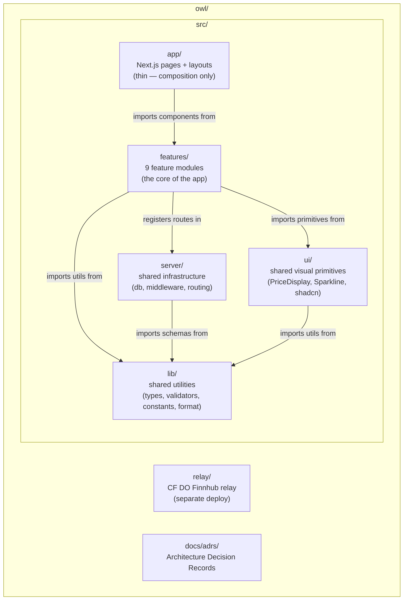
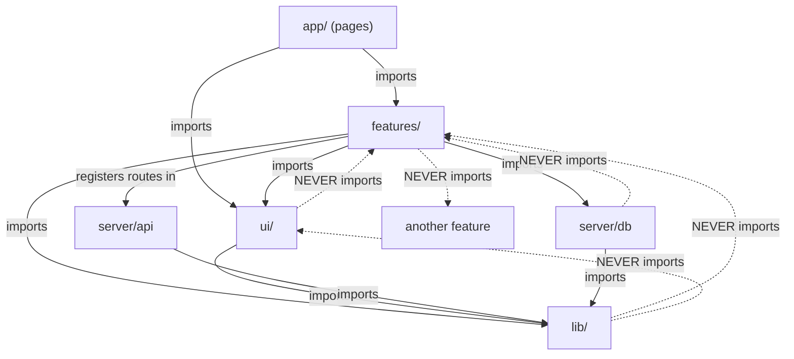

# ADR-006: Folder Structure

**Status:** Accepted
**Date:** 2026-03-21
**Decision Makers:** @mvula

## Context

Owl is a multi-feature financial platform with two deployment targets (Vercel + Cloudflare Workers) in a single repository. The codebase will grow across 10 implementation stages, from auth scaffolding to an embeddable widget. The folder structure must:

1. Scale from stage 1 (scaffold) to stage 10 (embed widget) without reorganization
2. Make it obvious where to find and where to put code for any given feature
3. Keep feature logic colocated — components, hooks, API routes, services, and types for a feature live together
4. Separate shared infrastructure (db, middleware, auth config) from feature-specific logic
5. Support two deployment targets (`src/` → Vercel, `relay/` → Cloudflare Workers) without monorepo tooling

## Decision

**Feature-based colocation.** Every feature owns its components, hooks, API routes, services, and types in one folder. Shared infrastructure and primitives live at the top level.

## Why Feature-Based Over Layer-Based

### Layer-based (rejected)
```
src/
  components/     ← 60+ files, mixed concerns
  hooks/          ← 30+ files, mixed concerns
  services/       ← mixed concerns
  api/            ← mixed concerns
```

**Problems at scale:**
- Adding a peg monitor feature means touching 4+ directories
- `components/` becomes a dumping ground — `MarketTable` sits next to `PegHealthBadge` sits next to `SignInForm`
- No clear ownership — who maintains `components/PriceDisplay.tsx`? Every feature uses it but nobody owns it.
- Deleting a feature requires searching across the entire tree

### Feature-based (selected)
```
src/
  features/
    peg/
      components/
      hooks/
      api/
      services/
      types.ts
```

**Advantages:**
- Adding the peg monitor = create `features/peg/`. Everything in one place.
- Deleting a feature = delete one folder. All references break visibly at compile time.
- Code review scope: a PR touching `features/portfolio/` is a portfolio change. Clear ownership.
- New developer onboarding: "the peg monitor lives in `features/peg/`" — done.
- IDE sidebar shows feature boundaries, not architectural layers.

---

## Full Structure



### `src/app/` — Next.js Pages (Thin Composition Layer)

Pages are thin. They import feature components, pass server data as props, and define layouts. No business logic, no data fetching beyond initial server-side queries.

```
src/app/
├── layout.tsx                        ← root layout: providers, fonts, global styles
├── (auth)/
│   ├── sign-in/page.tsx              ← imports features/auth/components/SignInForm
│   └── sign-up/page.tsx
├── (dashboard)/
│   ├── layout.tsx                    ← dashboard shell: sidebar, nav, status strip
│   ├── page.tsx                      ← market overview (default dashboard route)
│   ├── market/
│   │   ├── page.tsx                  ← coin/stock explorer
│   │   └── [symbol]/page.tsx         ← coin/stock detail
│   ├── portfolio/page.tsx
│   ├── watchlist/page.tsx
│   ├── peg/page.tsx
│   ├── correlation/page.tsx
│   ├── settlement/page.tsx
│   ├── alerts/page.tsx
│   └── settings/page.tsx
└── api/
    └── [[...route]]/
        └── route.ts                  ← Hono mount point (5 lines — delegates to server/api)
```

**Why `(auth)` and `(dashboard)` route groups:** Different layouts. Auth pages have no sidebar. Dashboard pages share the sidebar + nav + status strip layout. Route groups `()` in Next.js provide layout boundaries without affecting the URL.

**Why pages are thin:**
```tsx
// src/app/(dashboard)/market/page.tsx — example
import { MarketExplorer } from '@/features/market/components/market-explorer'
import { getMarketOverview } from '@/features/market/services/market-service'

export default async function MarketPage() {
  const overview = await getMarketOverview() // server-side fetch
  return <MarketExplorer initialData={overview} />
}
```

The page does two things: fetches initial data on the server, renders a feature component. That's it.

---

### `src/features/` — Feature Modules (The Core)

Each feature is a self-contained module. A feature can import from `ui/`, `lib/`, and `server/db`, but never from another feature directly. Cross-feature communication happens through shared stores (Zustand) or shared types (`lib/types/`).

```
src/features/
├── auth/
│   ├── components/
│   │   ├── sign-in-form.tsx
│   │   └── sign-up-form.tsx
│   ├── hooks/
│   │   ├── use-session.ts
│   │   └── use-auth.ts
│   ├── config/
│   │   ├── auth-server.ts            ← Better Auth server instance
│   │   └── auth-client.ts            ← Better Auth client instance
│   └── types.ts
│
├── market/
│   ├── components/
│   │   ├── market-explorer.tsx        ← main table with search/filter
│   │   ├── coin-detail.tsx            ← full detail page content
│   │   ├── coin-card.tsx
│   │   ├── trending-list.tsx
│   │   └── global-stats.tsx
│   ├── hooks/
│   │   ├── use-market-overview.ts     ← TanStack Query: global stats + trending
│   │   ├── use-coin-detail.ts         ← TanStack Query: coin metadata + chart data
│   │   └── use-search.ts              ← debounced CoinGecko search
│   ├── api/
│   │   └── market-routes.ts           ← Hono routes: /api/v0/market/*
│   ├── services/
│   │   ├── coingecko-client.ts        ← CoinGecko REST wrapper
│   │   └── cache.ts                   ← TTL cache layer for CoinGecko
│   └── types.ts
│
├── real-time/
│   ├── components/
│   │   ├── price-ticker.tsx           ← live updating price row
│   │   └── live-chart.tsx             ← Lightweight Charts wrapper hook
│   ├── hooks/
│   │   ├── use-binance-ws.ts          ← direct browser WS to Binance
│   │   ├── use-finnhub-ws.ts          ← WS to CF DO relay
│   │   └── use-market-stream.ts       ← combines both into unified MarketUpdate
│   ├── stores/
│   │   ├── price-store.ts             ← Zustand: Map<symbol, price>, RAF batcher
│   │   └── ui-store.ts                ← Zustand: sidebar, filters, preferences
│   ├── lib/
│   │   ├── normalizer.ts              ← Binance/Finnhub → MarketUpdate
│   │   ├── reconnection.ts            ← exponential backoff, 24hr rotation
│   │   └── batcher.ts                 ← requestAnimationFrame coalescing
│   └── types.ts
│
├── portfolio/
│   ├── components/
│   │   ├── holdings-table.tsx
│   │   ├── portfolio-summary.tsx
│   │   └── allocation-chart.tsx
│   ├── hooks/
│   │   ├── use-portfolio.ts           ← TanStack Query: portfolio from DB
│   │   ├── use-holdings.ts
│   │   └── use-pnl.ts                ← derives P&L from holdings × live prices
│   ├── api/
│   │   └── portfolio-routes.ts        ← Hono routes: /api/v0/portfolio/*
│   ├── services/
│   │   ├── pnl-calculator.ts
│   │   └── currency-converter.ts
│   └── types.ts
│
├── watchlist/
│   ├── components/
│   │   ├── watchlist-panel.tsx
│   │   └── draggable-symbol.tsx
│   ├── hooks/
│   │   └── use-watchlist.ts
│   ├── api/
│   │   └── watchlist-routes.ts
│   └── types.ts
│
├── alerts/
│   ├── components/
│   │   ├── alert-rule-form.tsx
│   │   ├── alert-list.tsx
│   │   └── webhook-config.tsx
│   ├── hooks/
│   │   ├── use-alerts.ts
│   │   └── use-webhooks.ts
│   ├── api/
│   │   └── alert-routes.ts
│   ├── services/
│   │   ├── alert-evaluator.ts
│   │   ├── webhook-dispatcher.ts
│   │   └── email-trigger.ts           ← Resend integration
│   └── types.ts
│
├── peg/
│   ├── components/
│   │   ├── peg-dashboard.tsx
│   │   ├── peg-card.tsx               ← per-stablecoin status card
│   │   └── deviation-chart.tsx
│   ├── hooks/
│   │   ├── use-peg-monitor.ts         ← derives from price store
│   │   └── use-deviation-history.ts   ← TanStack Query: historical deviation
│   ├── api/
│   │   └── peg-routes.ts
│   ├── services/
│   │   └── deviation-calculator.ts    ← multi-peg logic (USD + EUR)
│   └── types.ts
│
├── correlation/
│   ├── components/
│   │   ├── correlation-matrix.tsx
│   │   └── heatmap.tsx
│   ├── hooks/
│   │   └── use-correlation.ts
│   ├── api/
│   │   └── correlation-routes.ts
│   ├── services/
│   │   └── correlation-engine.ts
│   └── types.ts
│
└── settlement/
    ├── components/
    │   ├── path-comparison.tsx
    │   ├── chain-selector.tsx
    │   └── optimizer-result.tsx
    ├── hooks/
    │   └── use-settlement-paths.ts
    ├── api/
    │   └── settlement-routes.ts
    ├── services/
    │   ├── path-calculator.ts
    │   └── gas-estimator.ts
    └── types.ts
```

---

### `src/server/` — Shared Server Infrastructure

Not feature logic. Infrastructure that all features depend on.

```
src/server/
├── api/
│   ├── index.ts                      ← Hono app creation, global middleware
│   ├── routes.ts                     ← imports + mounts all features/*/api/ routes
│   └── middleware/
│       ├── auth.ts                   ← session validation
│       ├── rate-limit.ts             ← X-RateLimit-Remaining, Retry-After
│       ├── idempotency.ts            ← Idempotency-Key handling (UUID v4, 24hr)
│       ├── api-key.ts                ← owl_test_ / owl_live_ validation
│       └── audit-log.ts              ← request logging to Postgres
└── db/
    ├── index.ts                      ← Drizzle client (Supabase connection string)
    ├── schema.ts                     ← all table definitions
    └── migrations/                   ← Drizzle-generated SQL migrations
```

**Why `schema.ts` is one file (not per-feature):**
Drizzle schemas reference each other (foreign keys). `holding` references `portfolio`, `portfolio` references `user`. Splitting schemas per feature creates circular import issues. One schema file with clear sections (comments) is the pragmatic choice.

**How feature API routes get mounted:**

```typescript
// src/server/api/routes.ts
import { Hono } from 'hono'
import { marketRoutes } from '@/features/market/api/market-routes'
import { portfolioRoutes } from '@/features/portfolio/api/portfolio-routes'
import { alertRoutes } from '@/features/alerts/api/alert-routes'
// ... other features

const api = new Hono()
  .basePath('/api/v0')
  .route('/market', marketRoutes)
  .route('/portfolio', portfolioRoutes)
  .route('/alerts', alertRoutes)
  // ... other features

export { api }
export type AppType = typeof api  // exported for Hono RPC client type inference
```

Each feature defines its own Hono routes. `routes.ts` composes them into the full API. The mount point at `app/api/[[...route]]/route.ts` just imports this composed app.

---

### `src/ui/` — Shared Visual Primitives

Components used by 2+ features. These are the financial building blocks — not shadcn defaults.

```
src/ui/
├── primitives/
│   ├── price-display.tsx             ← tabular-nums, flash, direction color
│   ├── change-indicator.tsx          ← "+2.34%" with arrow
│   ├── peg-health-badge.tsx          ← HEALTHY / WARNING / CRITICAL
│   ├── sparkline.tsx                 ← custom SVG polyline
│   ├── currency-input.tsx            ← locale-aware formatting
│   └── status-strip.tsx              ← scrolling horizontal ticker bar
└── components/                       ← shadcn overrides
    ├── button.tsx
    ├── dialog.tsx
    ├── dropdown-menu.tsx
    ├── input.tsx
    ├── table.tsx
    ├── command.tsx                    ← symbol search palette
    ├── tooltip.tsx
    ├── toast.tsx                      ← sonner
    └── ...                            ← other shadcn components as needed
```

**Why separate `primitives/` from `components/`:**
- `primitives/` are Owl-specific, designed for financial data. They don't exist in any library.
- `components/` are shadcn overrides — Radix-based, accessible, restyled for our design system. They are generic UI elements.

**Rule: if a component is only used in one feature, it lives in that feature's `components/` folder, not here.** A component graduates to `ui/` only when a second feature needs it.

---

### `src/lib/` — Shared Utilities

Zero feature-specific logic. Types, validators, constants, and utility functions used across the app.

```
src/lib/
├── types/
│   ├── market.ts                     ← MarketUpdate, AssetType, PegStatus
│   └── api.ts                        ← ApiResponse<T>, ApiError, PaginatedResponse
├── validators/
│   └── shared.ts                     ← reusable Zod schemas (symbol, currency, pagination)
├── constants/
│   ├── stablecoins.ts                ← USDC, USDT, DAI, EURC, PYUSD, USDB, BUSD configs
│   ├── chains.ts                     ← Ethereum, Polygon, BSC, Arbitrum, Base, Bitcoin, TRON
│   ├── currencies.ts                 ← 35+ fiat currency codes and metadata
│   └── config.ts                     ← API URLs, cache TTLs, rate limit values
├── utils/
│   ├── format.ts                     ← cached Intl.NumberFormat / DateTimeFormat wrappers
│   ├── market-hours.ts               ← "closes in 2h 15m", EST/CET/EAT timezone logic
│   └── cn.ts                         ← tailwind-merge utility
└── hooks/
    └── use-media-query.ts            ← truly global hooks only (avoid putting feature hooks here)
```

---

### `relay/` — Cloudflare DO Finnhub Relay (Separate Deploy)

A standalone deployable unit. Has its own `package.json`, `tsconfig.json`, and `wrangler.jsonc`. Does not import from `src/` (Cloudflare Workers can't resolve Next.js path aliases).

```
relay/
├── wrangler.jsonc                    ← CF Worker + DO config
├── package.json                      ← relay-specific deps (hono, @hono/cloudflare-workers)
├── tsconfig.json
└── src/
    ├── index.ts                      ← Hono Worker: edge router, WS upgrade detection
    ├── finnhub-relay.ts              ← Durable Object class: lazy connection, ref counting
    ├── auth.ts                       ← JWT validation with shared secret
    └── types.ts                      ← MarketUpdate (duplicated from src/lib — see note)
```

**Why types are duplicated, not shared:** The relay runs on Cloudflare Workers (V8 isolate). It cannot resolve `@/lib/types` path aliases or import from the Next.js project. The `MarketUpdate` type is ~10 lines. Duplicating it is simpler and more reliable than setting up a shared package or workspace. If the type diverges, TypeScript won't catch it — this is a documented risk. A CI check can diff the two files to flag drift.

---

## Dependency Rules



| From | Can Import | Cannot Import |
|------|-----------|---------------|
| `app/` (pages) | `features/`, `ui/`, `lib/` | `server/` directly (use feature services) |
| `features/*` | `ui/`, `lib/`, `server/db`, register in `server/api` | Other `features/*` |
| `ui/` | `lib/` | `features/`, `server/` |
| `lib/` | Nothing (leaf node) | Everything |
| `server/` | `lib/` | `features/`, `ui/`, `app/` |
| `relay/` | Its own `src/` only | `src/*` (different deployment) |

**The "no cross-feature import" rule is the most important rule.** If `features/peg/` needs price data, it reads from the Zustand `priceStore` (defined in `features/real-time/stores/`). Wait — that's a cross-feature import.

**Exception: stores are shared infrastructure.**

The `priceStore` is consumed by every feature that displays prices. Move it:

```
src/stores/
├── price-store.ts    ← Zustand: Map<symbol, price>, RAF batcher
└── ui-store.ts       ← Zustand: sidebar, filters, preferences
```

Or keep it in `features/real-time/stores/` and treat `real-time` as infrastructure (like `server/`), not a feature. The latter is cleaner because the WebSocket hooks, normalizer, and batcher are tightly coupled to the store.

**Decision:** `features/real-time/` is the exception — it exports stores and hooks that other features consume. This is explicitly documented. No other feature exports to siblings.

---

## Path Aliases

```json
// tsconfig.json
{
  "compilerOptions": {
    "paths": {
      "@/*": ["./src/*"],
      "@/features/*": ["./src/features/*"],
      "@/ui/*": ["./src/ui/*"],
      "@/lib/*": ["./src/lib/*"],
      "@/server/*": ["./src/server/*"]
    }
  }
}
```

Usage: `import { PriceDisplay } from '@/ui/primitives/price-display'`

---

## Consequences

### Positive
- Feature isolation: adding/removing a feature is one folder operation
- Clear code ownership: PRs are scoped to feature boundaries
- Scales to 10+ features without reorganization
- IDE navigation mirrors mental model (feature-first, not layer-first)
- Dependency rules prevent spaghetti imports

### Negative
- `features/real-time/` breaks the "no cross-feature import" rule (documented exception)
- `server/db/schema.ts` is one file (Drizzle FK constraint), not per-feature
- `relay/types.ts` is duplicated from `lib/types/market.ts` (CI check mitigates drift)
- Feature boundaries require discipline — a lazy developer puts shared logic in a feature folder instead of `ui/` or `lib/`

### Risks
- Features growing too large (e.g., `market/` with 20+ components). Mitigation: split into sub-features when a folder exceeds ~15 files.
- Circular dependencies between features if the "no cross-feature" rule is violated. Mitigation: ESLint `import/no-restricted-paths` rule (enforced in CI).

## Related Decisions
- [ADR-002: System Architecture](./002-system-architecture.md) — deployment topology
- [ADR-003: WebSocket Hosting](./003-websocket-hosting.md) — relay/ directory
- [ADR-004: Product Strategy](./004-product-strategy.md) — feature scope
- [ADR-005: Tech Stack](./005-tech-stack.md) — libraries mapped to features
