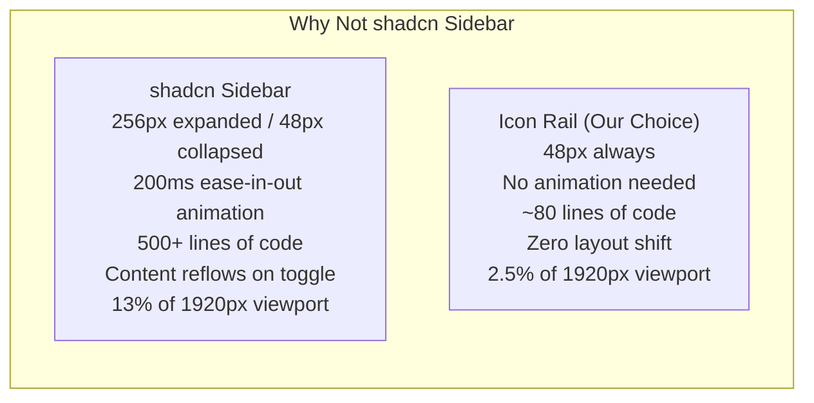
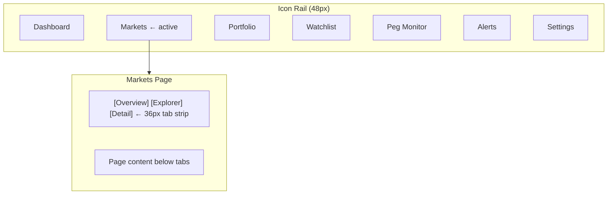
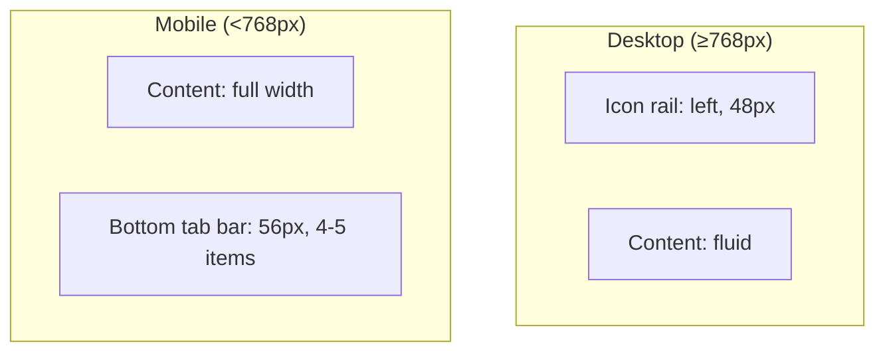
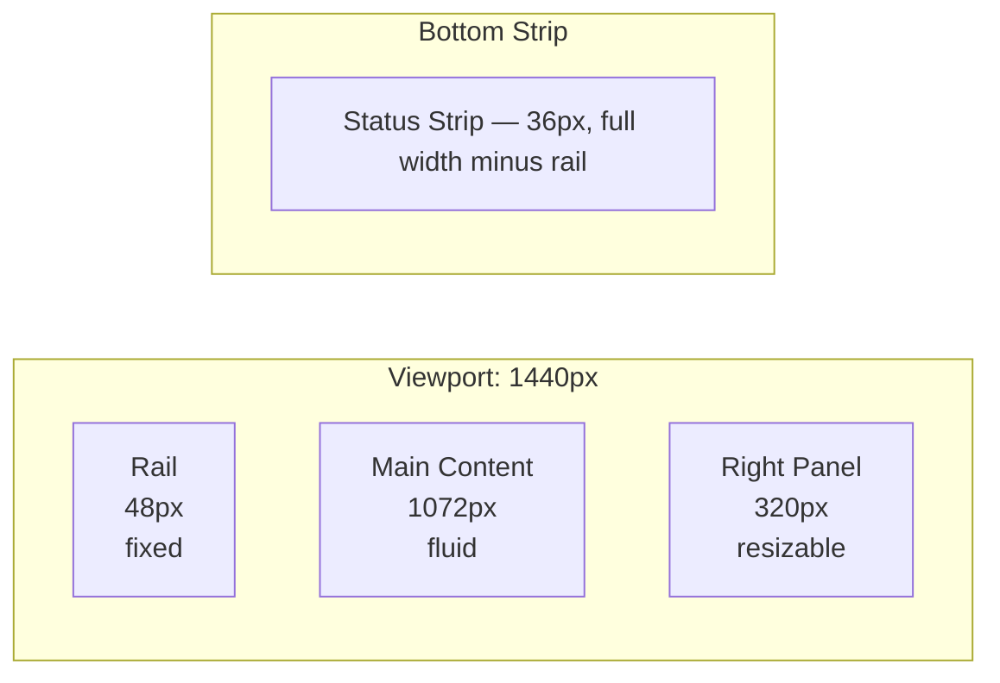
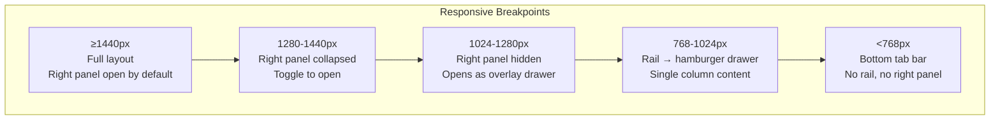
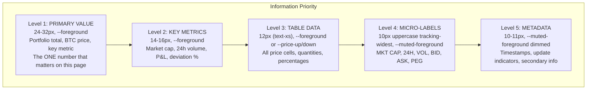
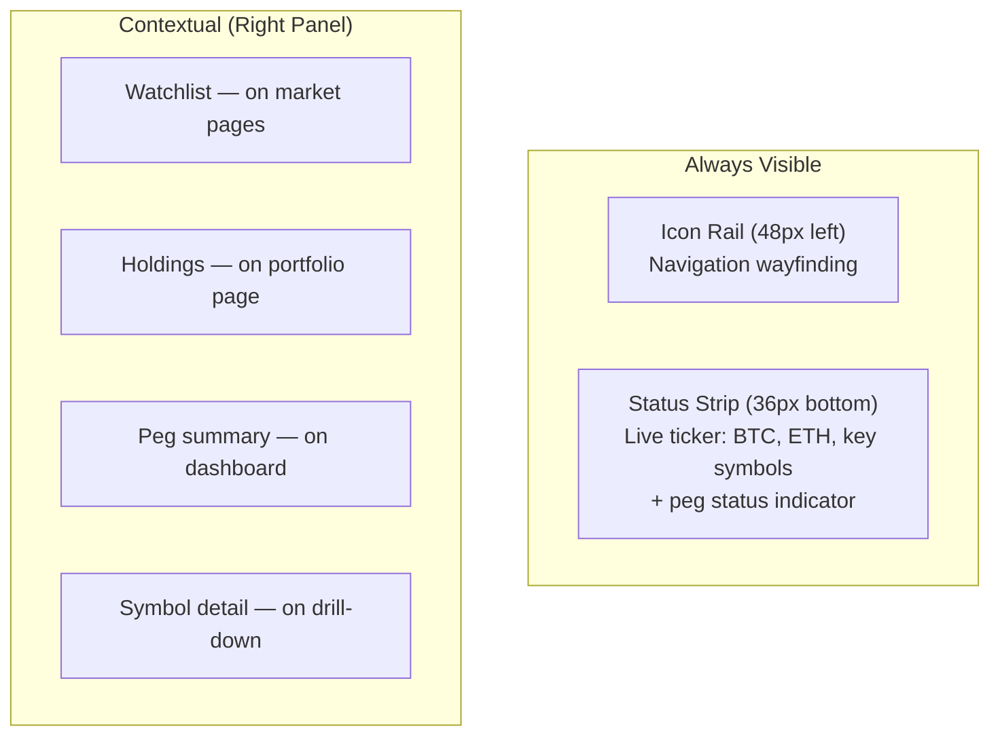
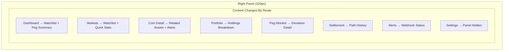
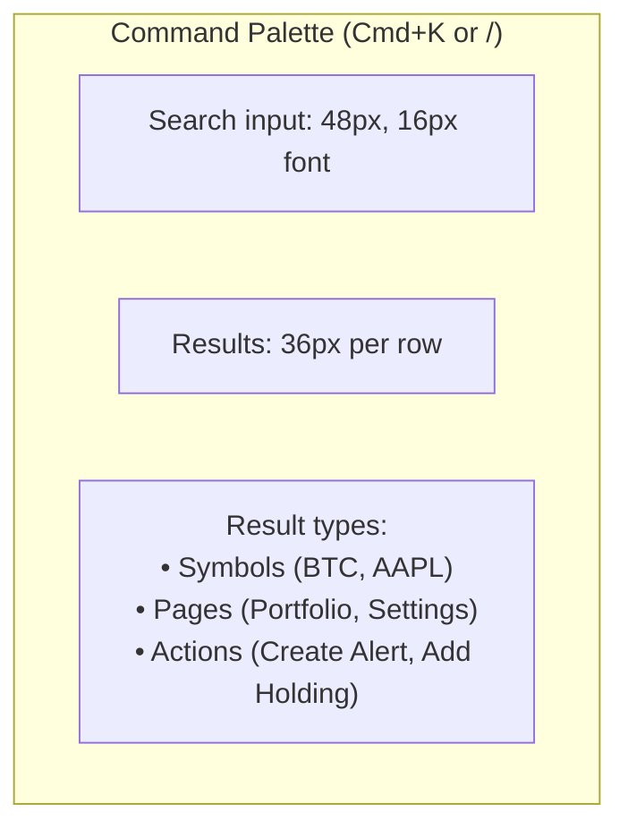
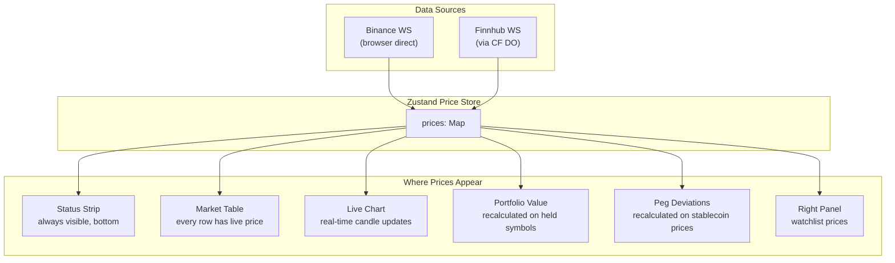

# ADR-007: UX Architecture

**Status:** Accepted
**Date:** 2026-03-21
**Decision Makers:** @mvula

## Context

UX architecture must be decided before any UI code is written. LLMs default to generic SaaS layouts — a sidebar because "dashboards have sidebars," cards because "data goes in cards." Every structural decision in Owl's UX must be backed by how real users interact with financial data, studied from platforms that serve millions of traders daily.

This ADR covers: navigation model, layout grid, information hierarchy, viewport strategy, keyboard navigation, page composition, and the persistent elements that define Owl's user experience. Not visual design — structural decisions that determine how users navigate, discover, and consume real-time financial data.

---

## Navigation: 48px Icon Rail

**Decision:** A fixed 48px icon rail on the left edge. No flyout. No expand/collapse. No shadcn sidebar.



### Why 48px Icon Rail Over shadcn Sidebar

| Problem with shadcn sidebar | How the icon rail solves it |
|----------------------------|---------------------------|
| 256px expanded steals 13-21% of viewport | 48px always — content gets `calc(100vw - 48px)` permanently |
| 200ms ease-in-out animation feels slow | No animation — rail never changes size |
| Content reflows on toggle (layout shift) | Zero layout shift — main content dimensions are constant |
| Accordion sub-items add visual noise | No sub-items in rail — sub-navigation lives in-page as horizontal tabs |
| `useSidebar()` context couples every nav item to global state | Simple `usePathname()` for active state — no context needed |
| 500+ lines of generic component code | ~80 lines purpose-built for our nav |

### Why 48px Specifically

WCAG 2.5.5 (AAA) minimum target size is 44px. 48px gives 2px margin per side. Each nav item is a full `48×48px` touch target. Phosphor icons at 20px, centered.

TradingView uses 56px. Bloomberg uses no sidebar. Coinbase uses 64px collapsed. We chose 48px because:
- Smaller than TradingView's 56px — every pixel matters for chart/table real estate
- Still meets accessibility standards
- Large enough that icons are instantly recognizable without labels

### Active State

Active nav item: Phosphor icon shifts from `weight="regular"` to `weight="bold"` + `bg-accent` background. This weight shift is a subtle active signal used by Linear — no color change needed, just visual weight. Driven by `usePathname()` — a client component hook that checks `pathname.startsWith(href)`.

### Sub-Navigation

Sub-pages within a section (e.g., Market → Explorer, Market → Detail) are handled by a **36px horizontal tab strip** inside the section's layout file, NOT in the rail. The rail selects the domain. In-page tabs handle sub-pages.



This is TradingView's exact pattern. The rail never needs more than one level of navigation.

### Mobile Navigation



- Rail is `hidden md:flex`
- Bottom tabs are `flex md:hidden`
- Bottom bar height: 56px (native app convention)
- Shows 4-5 primary items: Dashboard, Markets, Portfolio, Peg, More

No hamburger menu. Hamburger menus hide navigation behind an extra tap — hostile to frequent navigation. Bottom tabs are always visible, always one tap.

---

## Layout Grid

### Desktop Layout (≥1280px)



```
┌────┬────────────────────────────────┬──────────┐
│    │                                │          │
│ 48 │         Main Content           │  Right   │
│ px │         (fluid)                │  Panel   │
│    │                                │  320px   │
│Rail│                                │          │
│    │                                │          │
│    ├────────────────────────────────┴──────────┤
│    │  Status Strip (36px)                      │
└────┴───────────────────────────────────────────┘
```

**At 1440px viewport:**
- Rail: 48px (fixed)
- Main content: 1072px (fluid, `calc(100vw - 48px - 320px)`)
- Right panel: 320px (default, resizable 200-480px)
- Status strip: 36px (fixed bottom, spans main + right panel)

**At 1920px viewport:**
- Rail: 48px
- Main content: 1552px
- Right panel: 320px

**Implementation:**

```css
body {
  display: flex;
  height: 100dvh;
  overflow: hidden;
}

.icon-rail {
  width: 48px;
  flex-shrink: 0;
}

.main-area {
  flex: 1;
  display: flex;
  flex-direction: column;
  overflow: hidden;
}

.main-content {
  flex: 1;
  overflow: auto;
}

.right-panel {
  width: 320px;
  flex-shrink: 0;
  resize: horizontal;
  min-width: 200px;
  max-width: 480px;
  overflow: auto;
}

.status-strip {
  height: 36px;
  flex-shrink: 0;
}
```

`height: 100dvh` (dynamic viewport height) is critical on mobile where browser chrome shifts the viewport. `overflow: hidden` on body prevents page-level scrolling — each panel scrolls independently.

### Viewport Strategy



| Breakpoint | Rail | Main Content | Right Panel | Status Strip |
|-----------|------|-------------|-------------|-------------|
| ≥1440px | 48px icon rail | Fluid | 320px, open | Bottom, full width |
| 1280-1440px | 48px icon rail | Fluid | Collapsed, toggle button | Bottom, full width |
| 1024-1280px | 48px icon rail | Fluid (full) | Overlay drawer (right) | Bottom, full width |
| 768-1024px | Hamburger → drawer | Full width | Hidden | Top, condensed |
| <768px | Hidden | Full width | Hidden | Top, condensed + bottom tabs |

**Minimum supported viewport: 768px.** Below this, Owl shows a condensed mobile view. We do NOT redirect to a separate app — the same codebase adapts.

**Target viewport: 1440px.** This is where the design is optimized. 1280px is the minimum "full experience."

---

## Information Hierarchy

### What the User Sees First (Within 100ms)



Every page has exactly ONE Level 1 element — the most important number on that page:

| Page | Level 1 (primary value) |
|------|------------------------|
| Dashboard | Total crypto market cap or portfolio total |
| Market Explorer | None (table is the focus) — Level 2 at most |
| Coin Detail | Current price of that asset |
| Portfolio | Portfolio total value + unrealized P&L |
| Peg Monitor | Worst deviation among monitored stablecoins |
| Settlement Optimizer | Recommended path net value |
| Alerts | Active alert count (badge, not large number) |

### Always-Visible Elements

These persist across ALL views, regardless of which page the user is on:



**The peg status indicator is critical.** If USDC depegs at 2am and the user is looking at their portfolio, they must see it immediately. A small colored dot in the status strip: green = all stable, yellow = warning, red = critical deviation. One glance, no navigation required.

---

## Status Strip

A 36px horizontal bar fixed at the bottom of the viewport (above bottom tabs on mobile). Shows live-updating ticker data.

```
┌─────────────────────────────────────────────────────────────────┐
│ BTC $42,341.20 ▲2.34%  ·  ETH $2,234.10 ▼0.82%  ·  USDC $1.0001 ●  ·  AAPL $187.42 ▲0.45% │
└─────────────────────────────────────────────────────────────────┘
```

### Structure
- Height: 36px
- Background: `--card` (one step lighter than base)
- Items: `[symbol] [price] [change%]` separated by `·` divider
- Font: 11px monospace, `tabular-nums`
- Colors: price in `--foreground`, change in `--price-up` or `--price-down`
- Peg indicator: colored dot (●) after stablecoin prices
- Overflow: horizontal scroll or CSS ticker animation for many symbols

### What Shows in the Strip
- User's top watchlist symbols (configurable)
- Always includes: BTC, ETH (crypto benchmarks)
- Always includes: one stablecoin peg status (worst deviation)
- Updates in real-time from Zustand price store

---

## Right Panel

### Behavior

The right panel is **persistent on desktop, contextual on content.**



### Resize Behavior
- Default: 320px
- Min: 200px
- Max: 480px
- Drag handle: left edge of panel, invisible until hover (4px hit zone, shows a 2px `--border` line on hover)
- Width persisted in localStorage

### Collapse Behavior
- ≥1440px: open by default
- 1280-1440px: collapsed by default, toggle button in main content header
- <1280px: overlay drawer (Radix Dialog styled as right sheet), triggered from main content
- Collapse/expand shortcut: `Cmd+.` (period)

---

## Command Palette

The primary search and navigation tool. Replaces both "search bar" and "go to page" functionality.



### Structure
- Trigger: `Cmd+K` (primary) or `/` (secondary, only when no input focused)
- Container: centered, 560px wide, `top: 20%` from viewport top
- Backdrop: `rgba(0,0,0,0.7)` + `backdrop-filter: blur(8px)`
- Input: 48px height, 16px font, no visible border (seamless with container)
- Results: 36px per row, icon left (16px), text center, shortcut right
- Max visible results: 8 (scrollable beyond)
- Keyboard: `↑`/`↓` navigate, `Enter` selects, `Escape` closes

### Result Types
```
🔍 Symbols:     BTC — Bitcoin          $42,341.20
                 AAPL — Apple Inc       $187.42
📄 Pages:        Portfolio              ⌘⇧P
                 Peg Monitor            ⌘⇧E
⚡ Actions:      Create Alert
                 Add to Watchlist
```

Built on shadcn `Command` component (which wraps `cmdk`). Already in our deps via Radix.

---

## Keyboard Navigation

### MVP Shortcuts (Stage 1-3)

| Key | Action | Context |
|-----|--------|---------|
| `Cmd+K` or `/` | Open command palette | Global |
| `Escape` | Close palette / modal / panel | Global |
| `J` | Next item in list | Table/list focused |
| `K` | Previous item in list | Table/list focused |
| `Enter` | Open selected item | Table/list focused |
| `Cmd+.` | Toggle right panel | Global |

### Power User Shortcuts (Stage 5+)

| Keys | Action |
|------|--------|
| `G` then `D` | Go to Dashboard |
| `G` then `M` | Go to Markets |
| `G` then `P` | Go to Portfolio |
| `G` then `W` | Go to Watchlist |
| `G` then `E` | Go to Peg Monitor |
| `G` then `A` | Go to Alerts |
| `G` then `S` | Go to Settings |
| `?` | Show keyboard shortcut reference |

Two-key navigation (`G` prefix) is Linear's pattern — inspired by Vim's `g` prefix. Differentiator for power users. Implemented with a keymap listener that tracks the previous key within a 500ms window.

---

## Page Composition

### Dashboard (Default Route)

```
┌──────────────────────────────────────┬──────────┐
│  GLOBAL STATS                         │ WATCHLIST│
│  ┌────────┐ ┌────────┐ ┌────────┐   │          │
│  │Mkt Cap │ │24h Vol │ │BTC Dom │   │ BTC ...  │
│  │$2.1T   │ │$89B    │ │52.3%   │   │ ETH ...  │
│  └────────┘ └────────┘ └────────┘   │ AAPL ... │
│                                       │          │
│  TRENDING         TOP MOVERS          │──────────│
│  ┌──────┐        ┌──────────┐        │ PEG      │
│  │1. SOL│        │PEPE +23% │        │ STATUS   │
│  │2. ETH│        │BONK +18% │        │          │
│  │3. BTC│        │SOL  +12% │        │ USDC ● OK│
│  └──────┘        └──────────┘        │ USDT ● OK│
│                                       │ DAI  ● OK│
│  MARKET OVERVIEW (top 20 by cap)      │          │
│  ┌──────────────────────────────┐    │          │
│  │ Symbol  Price   24h   MktCap│    │          │
│  │ BTC     $42K   +2.3%  $820B│    │          │
│  │ ETH     $2.2K  -0.8%  $268B│    │          │
│  │ ...                         │    │          │
│  └──────────────────────────────┘    │          │
├──────────────────────────────────────┴──────────┤
│  BTC $42,341 ▲2.3% · ETH $2,234 ▼0.8% · USDC ●│
└─────────────────────────────────────────────────┘
```

- Global stats: 3 KPI cards in a row, Level 2 values
- Trending + Top Movers: two columns, Level 3 data
- Market overview: compact table, top 20, with sparklines
- Right panel: watchlist + peg status summary

### Market Explorer

```
┌──────────────────────────────────────┬──────────┐
│  [Search 🔍] [Filter ▾] [Asset: All]│ WATCHLIST│
│                                       │          │
│  ┌──────────────────────────────┐    │ BTC ...  │
│  │ ★ Symbol  ⚡  Price   24h    │    │ ETH ...  │
│  │   BTC    ~~  $42,341 +2.3%  │    │          │
│  │   ETH    ~~  $2,234  -0.8%  │    │          │
│  │   SOL    ~~  $142    +5.1%  │    │          │
│  │   AAPL   ~~  $187    +0.4%  │    │          │
│  │   ...    ~~  ...     ...    │    │          │
│  │   (virtualized, 500+ rows)  │    │          │
│  └──────────────────────────────┘    │          │
├──────────────────────────────────────┴──────────┤
│  Status Strip                                    │
└─────────────────────────────────────────────────┘
```

- Search bar + filters: 48px, top of content area
- Full-width virtualized table: TanStack Table + Virtual
- Each row: star (watchlist toggle), symbol, sparkline (⚡~~), price, 24h change, market cap, volume
- Row height: 40px
- Clicking a row → navigates to coin/stock detail

### Coin/Stock Detail

```
┌──────────────────────────────────────┬──────────┐
│  [← Back]  BTC · Bitcoin              │ RELATED  │
│  $42,341.20        ▲ +$987.30 (+2.3%)│          │
│                                       │ ETH ...  │
│  ┌──────────────────────────────┐    │ SOL ...  │
│  │                              │    │          │
│  │    Lightweight Charts        │    │──────────│
│  │    (candlestick + volume)    │    │ ALERTS   │
│  │                              │    │          │
│  │    [1D] [1W] [1M] [3M] [1Y] │    │ No alerts│
│  └──────────────────────────────┘    │ [Create] │
│                                       │          │
│  [Overview] [Markets] [Historical]    │          │
│  ┌──────────────────────────────┐    │          │
│  │ Market Cap    $820B          │    │          │
│  │ 24h Volume    $28B           │    │          │
│  │ Circ. Supply  19.5M BTC     │    │          │
│  │ All-Time High $69,000       │    │          │
│  └──────────────────────────────┘    │          │
├──────────────────────────────────────┴──────────┤
│  Status Strip                                    │
└─────────────────────────────────────────────────┘
```

- Symbol + price: Level 1 (24-32px) + Level 2 change
- Chart: Lightweight Charts, takes ~60% of content height
- Time range selector: `[1D] [1W] [1M] [3M] [1Y] [ALL]` — 36px tab strip below chart
- Below chart: tabbed content (Overview, Markets, Historical)
- Right panel: related assets + alerts for this symbol

### Portfolio

```
┌──────────────────────────────────────┬──────────┐
│  PORTFOLIO VALUE                      │ALLOCATION│
│  $127,432.50     ▲ +$2,341 (+1.87%) │          │
│                                       │  ┌────┐ │
│  ┌──────────────────────────────┐    │  │ 🍩 │ │
│  │ Symbol  Qty    Cost   Value  │    │  │    │ │
│  │ BTC     0.5    $20K   $21.1K│    │  └────┘ │
│  │ ETH     2.0    $3.2K  $4.4K │    │ BTC 52% │
│  │ AAPL    10     $1.7K  $1.8K │    │ ETH 22% │
│  │ ...                         │    │ AAPL 9% │
│  └──────────────────────────────┘    │ ...     │
│                                       │          │
│  [+ Add Holding]                      │          │
├──────────────────────────────────────┴──────────┤
│  Status Strip                                    │
└─────────────────────────────────────────────────┘
```

- Portfolio total: Level 1 (24-32px)
- Holdings table: symbol, quantity, cost basis, current value, P&L (colored), allocation %
- Right panel: allocation donut chart + breakdown
- Add holding button opens a dialog (Radix Dialog), not a new page

### Peg Monitor

```
┌──────────────────────────────────────┬──────────┐
│  PEG MONITOR                          │ DETAIL   │
│  Worst: USDC -0.34% ⚠                │          │
│                                       │ USDC     │
│  ┌──────┐ ┌──────┐ ┌──────┐ ┌─────┐│ $0.9966  │
│  │ USDC │ │ USDT │ │ DAI  │ │EURC ││ -0.34%   │
│  │$0.997│ │$1.001│ │$1.000│ │€1.00││          │
│  │-0.34%│ │+0.05%│ │ 0.00%│ │0.00%││ ┌──────┐ │
│  │  ⚠   │ │  ●   │ │  ●   │ │ ●   ││ │~~dev~│ │
│  └──────┘ └──────┘ └──────┘ └─────┘│ │chart │ │
│  ┌──────┐ ┌──────┐ ┌──────┐        │ └──────┘ │
│  │PYUSD │ │ USDB │ │ BUSD │        │          │
│  │$1.000│ │$1.000│ │$0.999│        │ 24h hist │
│  │ 0.00%│ │+0.01%│ │-0.08%│        │ alerts   │
│  │  ●   │ │  ●   │ │  ●   │        │          │
│  └──────┘ └──────┘ └──────┘        │          │
│                                       │          │
│  DEVIATION HISTORY                    │          │
│  ┌──────────────────────────────┐    │          │
│  │  Area chart (all 7 overlaid) │    │          │
│  └──────────────────────────────┘    │          │
├──────────────────────────────────────┴──────────┤
│  Status Strip                                    │
└─────────────────────────────────────────────────┘
```

- Worst deviation: Level 1 (highlighted if warning/critical)
- 7 stablecoin cards: 2 rows, 4 per row. Each shows price, deviation %, health badge
- Card health badges: ● green (healthy), ⚠ amber (warning), 🔴 red pulse (critical)
- Deviation thresholds: warning at 0.2%, critical at 0.5% (configurable per coin)
- Clicking a card → right panel shows detail + deviation chart + alert config
- Bottom: deviation history area chart (all 7 overlaid, Lightweight Charts)
- EURC deviation is calculated against EUR, not USD — multi-peg logic

---

## Real-Time Data Flow Through the UI



**Update strategy by surface:**

| Surface | Update mechanism | React involvement |
|---------|-----------------|-------------------|
| Status strip | Zustand selector per symbol | Minimal — each symbol is a separate selector |
| Market table cells | `useRef` + direct DOM `textContent` for hot path | **None for the number itself** — bypasses React |
| Chart | `series.update()` on Lightweight Charts | **None** — canvas, not React |
| Portfolio value | Zustand derived computation in store | Re-render only when computed value changes |
| Peg deviations | Zustand derived computation in store | Re-render only when deviation changes |
| Right panel watchlist | Zustand selector per symbol | Minimal |

### Alert Surfacing

Alerts do NOT navigate the user. They surface in-place:

| Alert type | How it surfaces |
|-----------|----------------|
| Price threshold hit | Toast notification (Sonner) + badge count on Alerts rail icon |
| Peg deviation warning | Peg indicator in status strip changes from green to amber |
| Peg deviation critical | Peg indicator pulses red + toast notification |
| Webhook delivery failure | Badge on Alerts icon + inline error in alerts list |

Toasts appear bottom-right, above the status strip. Auto-dismiss after 5 seconds. Persistent if critical.

---

## Design Tokens (Reference for Implementation)

### Measurements

| Token | Value | Used For |
|-------|-------|----------|
| `--rail-width` | 48px | Icon rail |
| `--right-panel-width` | 320px | Right panel default |
| `--right-panel-min` | 200px | Right panel minimum |
| `--right-panel-max` | 480px | Right panel maximum |
| `--status-strip-height` | 36px | Bottom ticker strip |
| `--sub-nav-height` | 36px | In-page horizontal tab strips |
| `--table-row-height` | 40px | Standard market table rows |
| `--table-row-dense` | 28px | Dense tables (peg monitor, order book) |
| `--mobile-bottom-bar` | 56px | Mobile bottom tab bar |
| `--command-palette-width` | 560px | Command palette |

### Font Sizes

| Token | Value | Used For |
|-------|-------|----------|
| `--text-primary-value` | 24-32px | ONE key number per page |
| `--text-metric` | 14-16px | Key metrics, secondary values |
| `--text-data` | 12px (`text-xs`) | All table data, prices, quantities |
| `--text-micro` | 10px | Uppercase labels: `MKT CAP`, `24H`, `VOL` |
| `--text-meta` | 10-11px | Timestamps, secondary metadata |

### Animation Durations

| Token | Value | Used For |
|-------|-------|----------|
| `--duration-instant` | 75ms | Hover states, focus rings |
| `--duration-fast` | 120ms | Panel transitions, tooltip appear |
| `--duration-flash` | 200ms | Price flash green/red |
| `--ease-out-expo` | `cubic-bezier(0.16, 1, 0.3, 1)` | All panel animations (Linear's curve) |

---

## Consequences

### Positive
- Every structural decision is backed by how real financial platforms work
- 48px icon rail maximizes content area — charts and tables get the space they deserve
- Command palette replaces both search and navigation — one pattern for everything
- Status strip ensures critical data (prices, peg status) is always visible
- Right panel provides context without page navigation — reduces clicks
- Keyboard navigation makes Owl usable by power users without a mouse
- Responsive strategy covers desktop → mobile without a separate app

### Negative
- Icon-only rail has discoverability cost — new users may not know what icons mean (mitigated: Radix Tooltips with `delayDuration={0}`)
- 48px rail means only ~7-8 nav items fit vertically — constrains navigation growth
- Right panel adds complexity to every page (each route defines its panel content)
- Command palette requires investment in fuzzy search indexing across symbols, pages, and actions

### Risks
- Custom icon rail means no shadcn sidebar component to lean on — we own all the code and maintenance
- Two-key navigation (`G` prefix) may confuse users who aren't familiar with Vim conventions (mitigated: `?` shortcut shows reference, pattern only added in Stage 5+)
- Right panel content per route increases the surface area of each page implementation

## Related Decisions
- [ADR-002: System Architecture](./002-system-architecture.md) — deployment topology affects layout (SSR page shell + streaming real-time data)
- [ADR-005: Tech Stack](./005-tech-stack.md) — Lightweight Charts, TanStack Table, Zustand drive the real-time update strategy
- [ADR-006: Folder Structure](./006-folder-structure.md) — feature-based colocation means each feature owns its page composition
