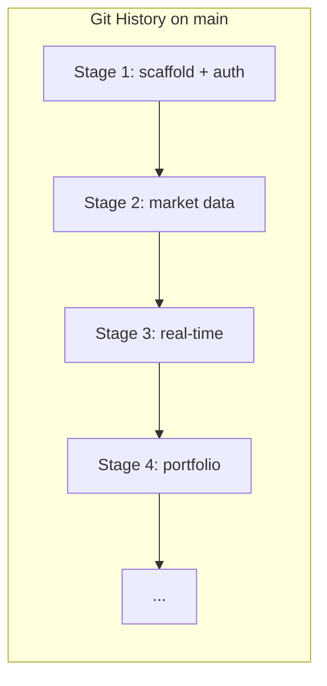
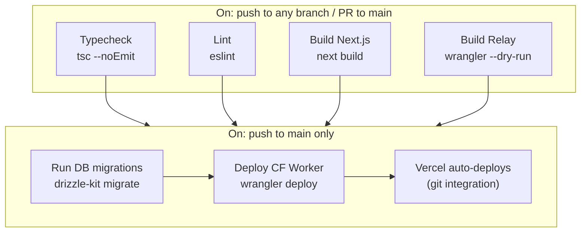
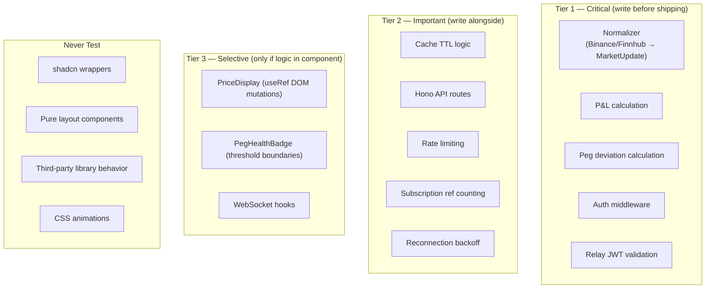

# ADR-008: Development Flow

**Status:** Accepted
**Date:** 2026-03-21
**Decision Makers:** @mvula

## Context

Owl is a 10-stage project built by a solo developer, deployed to two targets (Vercel + Cloudflare Workers) from a single repository. The development flow must:

1. Prevent broken code from reaching production
2. Not slow down a solo dev with team-scale ceremony
3. Produce a clean, auditable git history aligned to the staged implementation plan
4. Handle two deployment targets with a shared JWT secret and protocol
5. Scale from Stage 1 (scaffold) to Stage 10 (embed widget) without workflow changes

---

## Branching: Stage Branches + Squash Merge

**Decision:** One branch per stage. Squash merge to `main` when complete. `main` is always production-ready.



### How It Works

```
1. git checkout -b stage/1-auth         ← branch from main
2. Commit freely (WIP, "fix typo", all fine)
3. Push → Vercel auto-creates preview URL
4. Test on preview URL
5. When stage is done → gh pr create
6. CI passes (typecheck, lint, build)
7. Squash merge → one clean commit on main
8. Delete stage branch
9. git checkout -b stage/2-market       ← branch from updated main
```

### Why This Strategy

| Alternative | Why Rejected |
|-------------|-------------|
| **Trunk-based (direct to main)** | No preview before production. Every push is a production deploy. No CI gate. |
| **GitFlow (develop + main)** | `develop` branch is dead weight for Vercel CD. Creates merge sync overhead. Designed for versioned releases, not continuous deployment. |
| **Granular feature branches** | Creates rebasing overhead for a solo dev working sequentially. Stages already provide sufficient isolation. |
| **No branches (just main)** | Loses Vercel's free preview deployments — the best staging environment available at $0. |

### Why Squash Merge

The 40 WIP commits in `stage/3-real-time` collapse into one commit on `main`:

```
Stage 3: real-time prices — Binance direct WS + Finnhub CF DO relay

- Browser connects directly to Binance public WS (no auth)
- Finnhub relay on Cloudflare Durable Objects with lazy connection
- Client-side normalizer merges both streams into MarketUpdate
- Zustand price store with RAF batching
- Reconnection logic with exponential backoff
```

`main` reads like a structured narrative of the product's evolution.

### When to Deviate

| Situation | Adjustment |
|-----------|-----------|
| Hotfix needed on production | `git stash`, switch to `main`, commit fix directly, push. OR cherry-pick. |
| Trivial change (one-line config) | Commit directly to `main`. No branch overhead for a 5-minute task. |
| Risky experiment within a stage | `spike/approach-name` off the stage branch. Delete when done. |

---

## Commits: Conventional Commits

**Decision:** Conventional Commits with scoped types. Already in use — formalize it.

### Format

```
<type>(<scope>): <description>

[optional body]

[optional footer]
```

### Types

| Type | When | Example |
|------|------|---------|
| `feat` | User-visible behavior that didn't exist before | `feat(market): add sortable columns with persistent state` |
| `fix` | Corrects broken or wrong behavior | `fix(auth): redirect to login on 401 instead of 403` |
| `refactor` | Code restructure, no behavior change | `refactor(db): extract reusable query helper` |
| `perf` | Performance improvement | `perf(api): add response caching for market endpoint` |
| `docs` | Documentation only | `docs: add ADR-008 development flow` |
| `test` | Adding or correcting tests | `test(market): add integration tests for sort` |
| `ci` | CI config and scripts | `ci: add GitHub Actions workflow` |
| `chore` | Maintenance, deps, config | `chore(deps): update drizzle-orm to 0.31` |
| `build` | Build system changes | `build: configure wrangler for relay deployment` |

### Scopes

```
auth, market, real-time, portfolio, watchlist, alerts, peg, correlation, settlement, api, db, ui, infra, relay
```

### Breaking Changes

```
feat(api)!: replace session tokens with JWT

BREAKING CHANGE: existing sessions invalidated on deploy.
```

### Tooling (Phased)

- **Now:** Write conventional commits manually (already doing it)
- **Stage 2+:** Add `commitlint` + `lefthook` commit-msg hook once scopes are stable
- **Never:** gitmoji, semantic-release (not a published package)

---

## CI/CD Pipeline

### GitHub Actions Workflow



### Deploy Order (Critical)

```
1. CI checks pass (typecheck, lint, build)
2. Database migrations run (staging first, then production)
3. Cloudflare Worker deploys (if relay/ changed)
4. Vercel auto-deploys (triggered by push to main)
```

**Upstream first.** The relay is the upstream dependency. The frontend consumes it. Deploy relay before Vercel so the frontend never hits an outdated relay.

### Branch Protection on `main`

Required checks before merge:
- `typecheck` — must pass
- `lint` — must pass
- `build` — must pass

### What CI Does NOT Include

- E2E tests (too slow for every push, run manually before stage close)
- `import/no-cycle` (slow, run only in scheduled CI)
- Bundle size enforcement (manual with `@next/bundle-analyzer`)

### Pipeline Speed Target

Under 3 minutes for the fast path (no deploy). Under 5 minutes total with deployment.

```
tsc --noEmit:     ~20s
eslint:           ~15s
next build:       ~60s (cached)
wrangler dry-run: ~10s
─────────────────────
Total (parallel):  ~90s
```

---

## Deployment

### Vercel (Next.js + Hono API)

| Trigger | Environment |
|---------|-------------|
| Push to `main` | Production deploy (automatic) |
| Push to any other branch | Preview deploy (automatic, unique URL) |

Vercel's atomic deploy model: new deployment becomes live only after successful build. Failed build = old production stays live. Rollback is instant (5 seconds) via Vercel dashboard.

### Cloudflare Workers (Finnhub Relay)

| Trigger | Environment |
|---------|-------------|
| Push to `main` (CI, if `relay/` changed) | Production Worker |
| Manual `wrangler deploy --env preview` | Preview Worker (when needed) |
| `wrangler dev` | Local development |

### Environment Variables

```
Production (Vercel + CF Workers):
  DATABASE_URL          → Supabase production
  BETTER_AUTH_SECRET    → 32+ char random (unique to prod)
  RELAY_JWT_SECRET      → Shared between Vercel + CF Worker
  FINNHUB_API_KEY       → Production key
  COINGECKO_API_KEY     → Demo key (free tier)
  RELAY_URL             → wss://owl-relay.workers.dev

Preview (Vercel):
  DATABASE_URL          → Supabase staging project
  BETTER_AUTH_SECRET    → Different from prod
  RELAY_JWT_SECRET      → Can match prod (preview hits prod relay)

Local:
  .env.local            → Local values, never committed
```

**JWT secret coordination:** Both Vercel and CF Worker must share `RELAY_JWT_SECRET`. Rotation procedure:
1. Update in Vercel env vars
2. `wrangler secret put RELAY_JWT_SECRET`
3. Redeploy both

### Database Migrations

```
bun run db:migrate (against staging Supabase)  → verify
bun run db:migrate (against production Supabase) → deploy
```

**Migrations are additive-only.** Never drop columns in the same deploy that adds them. Two-phase for renames:
1. Add new column, copy data, deploy code that reads both
2. Next deploy: drop old column

---

## Testing Strategy

### Tools

| Tool | Purpose | Environment |
|------|---------|------------|
| **Vitest** | Unit + integration tests | `node` (pure logic) + `jsdom` (components) |
| **Playwright** | E2E critical flows | Browser |
| **MSW** | HTTP mocking (CoinGecko, etc.) | Vitest integration tests |
| **`@cloudflare/vitest-pool-workers`** | Relay DO tests | Miniflare |

### What Gets Tests (Prioritized)



### The Rule

**If a bug would show an incorrect price, execute a wrong calculation, or bypass auth → it gets a test. If it would misalign an icon → skip it.**

### Tests Per Stage

| Stage | Tests to Write |
|-------|---------------|
| 1 | Auth middleware (require auth, reject unauth, cross-user access) |
| 2 | Cache TTL, CoinGecko client mock, market route integration |
| 3 | Normalizers (full coverage), reconnection backoff, relay JWT, RAF batcher, selector isolation |
| 4 | P&L calculation (all edge cases), portfolio routes. First E2E: auth flow + portfolio P&L |
| 5 | Alert evaluator, webhook dispatcher, cooldown logic |
| 6 | Peg deviation (multi-peg USD + EUR), threshold boundaries |
| 7 | Correlation engine (Pearson r formula, edge cases) |
| 8 | Settlement path calculator, gas estimator |

### E2E (Playwright — 5 Tests Total)

1. Auth flow: sign up → sign in → session → sign out
2. Protected route: unauth → redirect
3. Market data loads (mock CoinGecko with `route()`)
4. WebSocket price update (mock with `routeWebSocket()`)
5. Portfolio P&L renders correctly

### Target: 60-80 unit/integration tests, 5 E2E tests

---

## Code Quality Automation

### ESLint (Keep, Enhance)

Current config is solid (`next/core-web-vitals` + `next/typescript`). Add type-aware rules:

```javascript
// High-value additions
'@typescript-eslint/no-floating-promises': 'error'      // unawaited promises silently swallow errors
'@typescript-eslint/no-misused-promises': 'error'        // async fn where void expected
'@typescript-eslint/consistent-type-imports': 'error'    // type-only imports
'@typescript-eslint/no-explicit-any': 'warn'             // any destroys Hono RPC type inference

// Feature boundary enforcement (add after folder structure stabilizes)
'import/no-restricted-paths': 'error'                    // no cross-feature imports per ADR-006
```

**Why not Biome:** No type-aware linting, no `@next/eslint-plugin-next`, no `eslint-plugin-react-hooks`. Biome is faster but misses the rules that catch the most bugs.

### TypeScript Config Additions

```json
{
  "compilerOptions": {
    "noUncheckedIndexedAccess": true,
    "exactOptionalPropertyTypes": true
  }
}
```

`noUncheckedIndexedAccess` is the highest-value addition: `array[0]` becomes `T | undefined`. Catches a class of runtime errors in data processing.

### Pre-commit Hooks: lefthook

```yaml
# lefthook.yml
pre-commit:
  parallel: true
  commands:
    lint:
      glob: "*.{ts,tsx}"
      run: bunx eslint --fix {staged_files}
      stage_fixed: true

pre-push:
  commands:
    typecheck:
      run: bun run typecheck
    test:
      run: bun test
```

**Why lefthook over husky:** Single Go binary, runs hooks in parallel, native staged file filtering. What Hono uses internally.

**Why lint on pre-commit, typecheck on pre-push:** Lint on staged files is <500ms. Typecheck takes 3-8s and grows — too slow for every commit, fine for every push.

### Formatting

- **Prettier** (already standard with Next.js)
- **EditorConfig** for cross-editor consistency
- Format on pre-commit via lefthook (`staged_files` only)

### Bundle Analysis

- `@next/bundle-analyzer` — run manually with `ANALYZE=true bun run build`
- Run when adding a significant dependency, not on every commit
- Budget: <250 KB gzipped total (from ADR-005)

### Security

- `bun audit` — manual, part of stage close checklist
- **Renovate** — automated dependency updates with grouping, automerge for patches
- Set up after first production deploy

---

## Definition of Done

### Universal Gate (Every Stage)

```
AUTOMATED (must pass in CI before merge)
├── tsc --noEmit exits 0
├── eslint exits 0
├── next build succeeds
├── All unit tests pass
└── relay/ builds (if touched)

MANUAL (before closing the stage)
├── Production deploy to Vercel succeeded
├── Smoke test checklist completed (stage-specific)
├── No console.error in browser during smoke test
├── No hydration mismatch warnings
├── All new env vars documented in .env.example
└── Scope statement written: "This stage ships X. It does NOT ship Y."
```

### Performance Gates (Non-Negotiable)

| Metric | Gate | Tool |
|--------|------|------|
| LCP | ≤ 2.5s | Lighthouse CI |
| INP | ≤ 200ms | Lighthouse CI |
| CLS | = 0.0 | Lighthouse CI |
| Bundle total | ≤ 250 KB gz | `@next/bundle-analyzer` |
| Price update framerate | 60fps at 50 updates/sec | Chrome Performance panel |

**A stage that ships a performance regression is not done.**

### The One Rule

**If the numbers are wrong, nothing else matters.** Every stage involving financial math requires manual verification against an external source (spreadsheet, calculator, known API response) before closing. P&L to the cent. Peg deviation to the basis point. There is no automated substitute.

### Cutting Scope

Ask: **does this bug break the core value of this stage?**
- Yes → fix before closing
- No → file issue tagged with stage number, move on

Bugs found in later stages that belong to earlier stages:
- **P1 (incorrect data, auth bypass):** Stop. Fix immediately.
- **P2 (UI glitch, non-critical):** Issue tagged `[Stage N bug / found in Stage M]`. Continue.
- **Type error regression:** Fix in current PR before merge.

---

## Monitoring

### From Stage 1

| Service | Cost | Purpose |
|---------|------|---------|
| **Vercel Analytics** | $0 | Web Vitals (LCP, INP, CLS) per route |
| **Sentry** (free tier) | $0 | Error tracking with source maps, 5K errors/month |
| **UptimeRobot** (free tier) | $0 | 5-minute health checks, email alerts |

### Health Endpoints

- `GET /api/v0/health/public` → `200 { status: "ok" }` (unauthenticated)
- `GET /api/v0/health` → `200` with DB/cache/relay status (authenticated)
- CF Worker: `GET /health` → `200`

### Total Infrastructure Cost

| Service | Free Tier |
|---------|-----------|
| Vercel Hobby | $0 |
| Cloudflare Workers | $0 |
| Supabase (×2 projects) | $0 |
| Sentry | $0 |
| UptimeRobot | $0 |
| GitHub Actions | $0 |
| **Total** | **$0/month** |

---

## Consequences

### Positive
- Clean git history: one squash commit per stage on `main`
- Free staging via Vercel preview deployments
- CI catches type errors, lint issues, and build failures before production
- Additive-only migrations prevent database rollback nightmares
- Lefthook catches issues locally before they reach CI
- $0/month total infrastructure during all 10 stages

### Negative
- Squash merge loses granular commit history on `main` (preserved on deleted branch refs)
- Pre-push typecheck adds 3-8s friction per push
- Two deployment targets require coordinated JWT secret management
- No automatic E2E tests in CI (too slow, run manually)

### Risks
- GitHub Actions free tier (2K min/month private repo) could be hit with very high push frequency
- Additive-only migrations defer cleanup — accumulates unused columns if not disciplined
- Sentry free tier (5K errors/month) may be exceeded if a real bug hits production at scale

## Related Decisions
- [ADR-002: System Architecture](./002-system-architecture.md) — deployment topology
- [ADR-003: WebSocket Hosting](./003-websocket-hosting.md) — CF Worker deployment
- [ADR-005: Tech Stack](./005-tech-stack.md) — tools referenced here
- [ADR-006: Folder Structure](./006-folder-structure.md) — `import/no-restricted-paths` enforcement
- [ADR-007: UX Architecture](./007-ux-architecture.md) — performance gates
